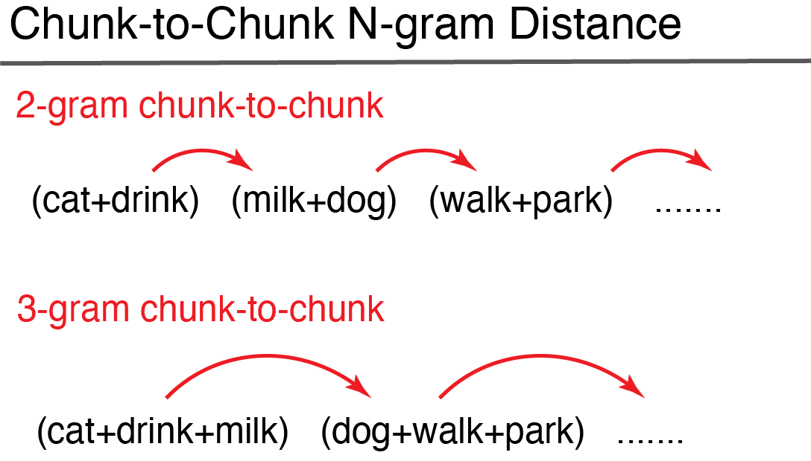
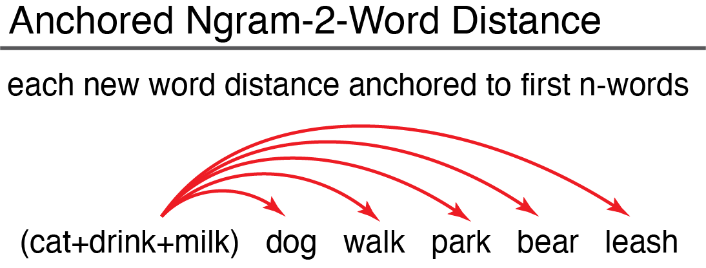

<!-- README.md is generated from README.Rmd. Please edit that file -->

```{r, include = FALSE}
knitr::opts_chunk$set(
  collapse = TRUE,
  comment = "#>",
  fig.path = "man/figures/README-",
  out.width = "100%"
)
```

# SemanticDistance


<!-- badges: start -->
[](https://github.com/Reilly-ConceptsCognitionLab/SemanticDistance/actions/workflows/R-CMD-check.yaml)
<!-- badges: end -->

SemanticDistance cleans and formats your target text (embedded in a dataframe). The package then computes pairwise metrics of cosine semantic distance between different adjacent chunks (e.g., ngrams, words, turns). The program appends two different semantic distance metrics, experiential and embedding. Experiential semantic distance reflects cosine (normalized from 0) between two vectors spanning 15 meaningful semantic dimensions (e.g., color, sound, valence). Embedding-based semantic distances are derived by contrasting each word's corresponding semantic vector spanning 300 hyperparameters as trained on the GLOVE word embedding model. The SemamticDistance package contains lookup databases with semantic vectors spanning >70k English words. <br/>

SemanticDistance operates on a dataframe that nominally has one column of text that has been split into a one word-per-row format. The package can also produce distance values for words arrayed in two columns. Users have numerous 'chunking' options for rolling distance comparisons in either monologues (no speaker information) or dialogues (speakers identifed as in conversation transcripts). Chunk options include: <br/>
1) word-to-word <br/>
2) ngram-to-ngram <br/>
3) ngram-to-word (rolling) <br/>
4) turn-to-turn (split by talker ID) <br/>

# Installation
Install the development version of SemanticDistance from [GitHub](https://github.com/) with:

``` r
install.packages("devtools")
devtools::install_github("Reilly-ConceptsCognitionLab/ConversationAlign")
```
# Load Package
```{r, message=FALSE}
library(SemanticDistance)
```

# ---Step 1 CLEAN AND PREP TEXT ---
SemanticDistance works on monologues (no talker information), dialogues (two or more speakers), word pairs arrayed in columns, and unstructured word lists (for hierarchical clustering). Cleaning can even handle unstructured text pasted into a single cell of a csv file. However, you MUST run an appropriate cleaning function before you run any distance functions even if you do not apply any of the cleaning options. These functions append unique identifiers that are used in the distance calculations. Instructions: <br/>
|     1) Prep your string data (csv or text) and read it into R (e.g., myrawdat). Call your objects and 
|        variables anything you like. SemanticDistance will retain your metadata.
|     2) Your data should contain at least one column with some string data in it (e.g., mytext)
|     3) Identify the format of your sample (e.g., monologue, dialogue, columns, unstructured)
|     4) Decide on your cleaning parameters (lemmatize?, omit stopwords?, omit punctuation?)
|     5) Specify the cleaning function and arguments that best fit your aims. 

## Monologue Formats
### Monologue Transcript (clean_monologue)
This could be a story etc. - basically any string where word order matters but you don't care about talker information. Your target text will be split and unlisted into a one word per row format.All other metadata will be retained. Here's a sample monologue with all sorts of junk in a column called 'word'. The 'clean_monologue' function will split and append a unique identifier to each word while retaining empty strings that could be meaningful. Defaults are to omit stopwords and lemmatize. The arguments and defaults to clean_monologue are: <br/>

| df = your raw dataframe with at least one column of text
| wordcol = quoted variable reflecting the column name where your target text lives (e.g., 'mytext') 
| clean = applies cleaning functions (e.g., punct out, lowercase, etc); default is TRUE
| omit_stops = omits stopwords, default is TRUE
| lemmatize = transforms raw word to lemmatized form, default is TRUE
```{r}
#raw messy transcript of a monologue with missing obs and text that needs to be split
head(MonologueSample1, n=6)
my_clean_dat <- clean_monologue(MonologueSample1, 'word', clean=T)
head(my_clean_dat, n=10)
```
<br/>

### Word Pairs Arrayed in Columns (clean_2columns)
SemanticDistance also computes pairwise distance for data arrayed in columns. Run the function, the cleaned columns will appear in the dataframe. Arguments to the function minimally include dataframe name, column name containing the first word and column name containing the second word (quoted)
```{r}
head(ColumnSample, n=6) #prints raw data
MyCleanColumns <- clean_2columns(ColumnSample, 'word1', 'word2', clean=T, omit_stops=T, lemmatize=T)
head(MyCleanColumns, n=6) #view head cleaned data
```
<br/>

### Unordered Word List for Hierarchical Clustering (clean_4clustering)
This cleaning option is used for prepping a vector of words for hierarchical clustering. Word order is no longer a factor since all words will be shuffled. This cleaning function retains only one instance of a word (no duplicates). 
```{r}
#vector of words organized by semantic category
#myrelated <- clean_4clustering(FakeCats, wordcol="word", clean=TRUE, omit_stops=TRUE, lemmatize=TRUE) 
```
<br/>
<br/>

## Clean DIALOGUE Formats 
### Dialogue Transcript (clean_dialogue)
This could be a conversation transcript or any language sample where you care about talker/interlocutor information (e.g., computing semantic distance across turns in a conversation). Here's what you need to specify in the function call... df = dataframe,  wordcol = column name (quoted) containing the text you want cleaned, whotalks = column name (quoted) containing the talker ID (will convert to factor), omit_stops = option for omitting stopwords, default is TRUE, lemmatize = option for lemmatizing strings, default is TRUE <br/>
```{r}
data("DialogueSample1")
head(DialogueSample1, n=6)
dyad <- clean_dialogue(DialogueSample1, "word", "speaker", omit_stops=T, lemmatize=T)
head(dyad, n=6)
```
<br/>

# ---Step 2 Compute Semantic Distance---
Users have several options for chunking pairwise semantic distance comparisons. SemanticDistance contains two embedded lookup databases, each with coverage of >60k English words. One metric 'CosDist_SD15' reflects pairwise cosine distance between semantic vectors spanning 15 dimensions (e.g., color, sound, etc). Another metric (CosDist_Glo) reflects cosine distance between the 300-dimension embedding vectors tagged to each word (or averaged across the words within an ngram or turn).

# Monologue Distance Options 
## Option 1: Distance rolling ngram-to-word (semdist_ngram2word_roll)


Users specify an ngram window size. This window rolls successively over your language sample to compute a semantic distance value for each new word relative to the n-words (ngram size) before it. This model of compouting distance is illustrated in the figure. The larger your specified ngram size the more smoothed the semantic vector will be over your language sample. Once you settle on a window size and clean your language transcript (works for monologues only), you are ready to roll. Let's analyze one of the embedded datasets called 'FakeCats' that has 50 words grouped by semantic categories. We will clean the original data first (use clean_monologues) and then run the dist_ngram2word_roll function on it, specifying an ngram size of 1 (i.e., semantic distance from each word to the word immediately preceding it)
```{r}
FakeCatsClean <- clean_monologue(FakeCats, "word") 
MyDists <- dist_ngram2word_roll(FakeCatsClean, 1) #takes dataframe name and ngram size as args
head(MyDists, n=8)
```
<br/>

### Option 2: Distance ngram-to-ngram chunked (semdist_ngram2ngram)


Joins target transcript (a long vector of words) to lookup database so each word has a corresponding semantic vector in row form. For example, if interested in 4-word chunks, then dog-cat-milk-banana (Ngram_4) would be the first ngram. We will aggregate the semantic vectors for all four words into a mean vector for that 4-gram then compute the distance to the next 4-gram iterating through the dataframe to the last possible chunk of four words omitting the 'leftovers' (residual/remainder not divisible by the ngram size). For example if there are 22 words and the user is interested in 3-grams, there would be 7 of these with one word left over in the last row.

```{r}
#Give the function a cleaned monologue transcript, let's do distance between successive two word chunks
ngramchunked <- dist_ngram2ngram(my_clean_dat, ngram=2)
```
<br/>

### Option 3: Distance column-arrayed word pairs (semdist_2cols)


When your data are arrayed in two columns and you are interested in computing pairwise distance across the columns. The only critical argument is your dataframe name. Remember to pass a cleaned dataframe (even if you disable stopwords and lemmatization)!

```{r}
DistsColumns <- dist_2cols(MyCleanColumns) #only argument is dataframe
head(DistsColumns, n=8)
```
<br/>

### Option 4: Distance anchored (fixed) ngram-to-word (anchor_dist)


This approach models the semantic distance from each successive new word in a language sample to the average of the semantic vectors for the first block of 10 content words in that sample. This anchored distance provides a metric of overall semantic drift as a language sample unfolds relative to a fixed starting point. 
```{r}
#tbd
```
<br/>

### Option 5: Hierarchical Clustering of a Set of Words 
Input a set of words cleaned/prepped with 'clean_4clustering' function.

```{r}
#TBD
```


# ---Step 3---
# Data Visualization Options


