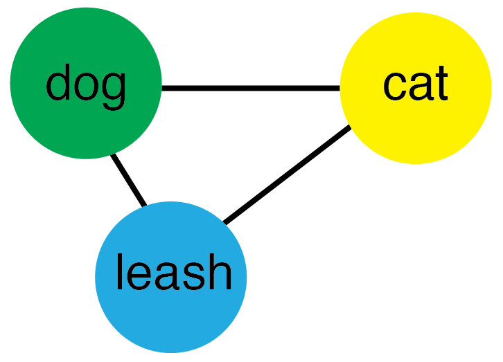
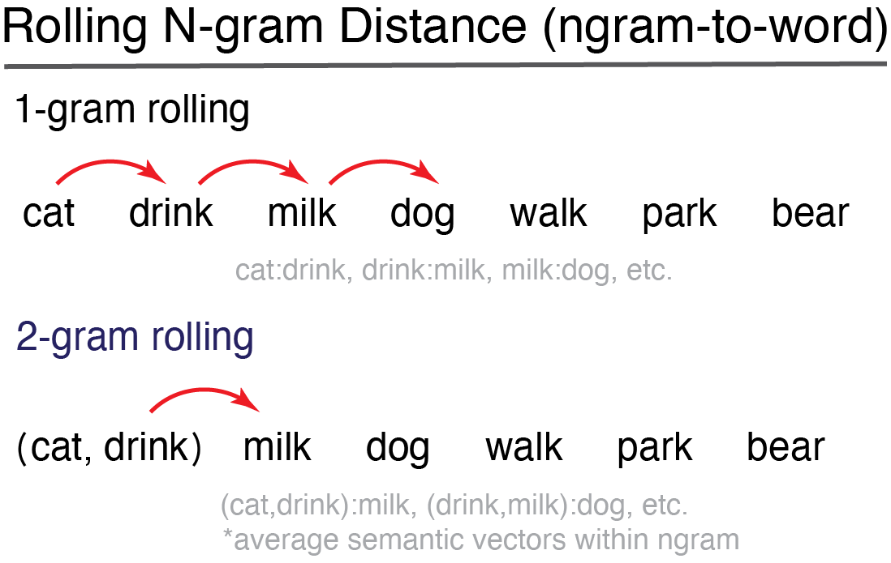
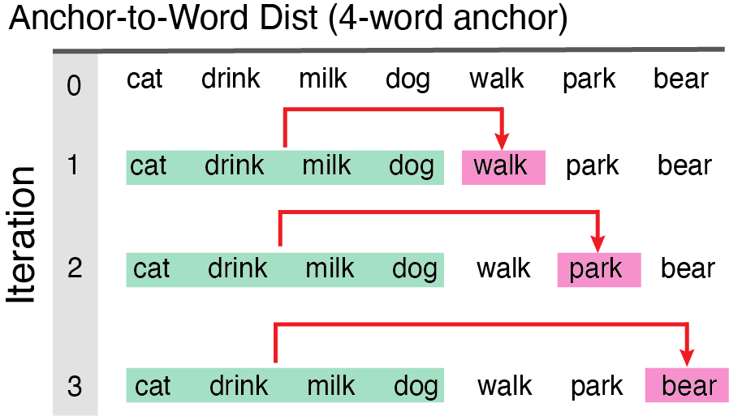

<!-- README.md is generated from README.Rmd. Please edit that file -->

```{r, include = FALSE}
knitr::opts_chunk$set(
  collapse = TRUE,
  comment = "#>",
  fig.path = "man/figures/README-",
  out.width = "100%")
```


<br/>

<!-- badges: start -->
[](https://github.com/username/yourpackage/releases)
[](https://github.com/Reilly-ConceptsCognitionLab/SemanticDistance/actions/workflows/R-CMD-check.yaml)
[](https://github.com/username/yourpackage/graphs/commit-activity)
[](https://lifecycle.r-lib.org/articles/stages.html)
[](http://depsy.org/r/yourpackage)
[](https://opensource.org/licenses/MIT)
<!-- badges: end -->

# Data Compatibility
SemanticDistance can compute pairwise semantic distance relationships in ordered and unordered language samples, including: **Monologues**: Any ordered text sample NOT delineated by a talker/speaker (e.g., stories, narratives). The minimal requirement for a monologue is one row and one column with some text in it.; **Dialogues**: An ordered language sample split by a talker/speaker/interlocutor factor. The minimum requirment is two cells with interlocutor identity and some text; **Word Pairs in Columns**: Paired string data arrayed across two columns (e.g., Dog-Leash); **Unordered Word Lists**: Unordered list of words (nominally one column, all text in one row) that will be transformed into a distance matrix, network model, or dendrogram <br/>

# Prep and Analyze Your Data
1) Store your text and project files within a dedicated folder/directory (e.g., 'mytexts/') <br/>
2) Format your data as CSV or txt. Although SemanticDistance is fairly robust to different character encodings, many proograms such as Excel introduce weird hidden characters into strings. <br/>
3) Label your target text and metadata columns offline however you like (e.g., mytext, word, langoutput) <br/>
4) Import your text and associated metadata (e.g., document_id, timestamps, etc.) as a dataframe. <br/>
5) Identify the format of your sample (e.g., monologue, dialogue, columns, unstructured).
6) Install and load the SemanticDistance package
7) Choose a principled set of cleaning parameters (e.g., should I omit stopwords? should I lemmatize?) <br/>
8) Run the approproate cleaning function that best fits your data stucture and aims <br/>
9) Run the appropriate distance function that best fits your data stucture and aims <br/>
10) Visualize your data using built-in functions or follow-up with your own preferred statistical approach. <br/> 

Install the development version of SemanticDistance from [GitHub](https://github.com/) using devtools.
```{r, message=FALSE}
#install.packages("devtools")
#devtools::install_github("Reilly-ConceptsCognitionLab/SemanticDistance")
library(SemanticDistance)
```

# --MONOLOGUES--
## Step 1: Clean 
## <span style="color: darkred;"> Clean Monologue Transcript (clean_monologue) </span>
Transforms all text to lowercase then optionally cleans (omit stopwords, omit non-alphabetic chars), lemmatizes (transforms morphological derivatives of words to their standard dictionary entries), and splits multiword utreerances into a one-word-per row format. You can generally leave split_strings in its default state (TRUE).  'clean_monologue' appends several new variables to your original dataframe:  **id_row_orig** a numeric identifier marking the original row where a word or group of words appeared; **'id_row_postsplit** a unique identifier marking each word's ordered position in the dataframe after splitting multiword utterances across rows; **word_clean** result of all cleaning operations, needed for distance calculations. <br/>

Arguments to 'clean_monologue': <br/> 
**dat** = raw dataframe with at least one column of text <br/>
**wordcol** = quoted variable column name where your target text lives (e.g., 'mytext') <br/>
**clean** = applies cleaning functions (e.g., punct out, lowercase, etc); T/F default is TRUE <br/>
**omit_stops** = omits stopwords, T/F default is TRUE <br/>
**lemmatize** = transforms raw word to lemmatized form, T/F default is TRUE <br/>
**split_strings** = option to split multiword utterances into separate rows, T/F default is TRUE
```{r, message=FALSE}
Monologue_Cleaned <- clean_monologue(dat=Monologue_Structured, wordcol='mytext', clean=TRUE, omit_stops=TRUE, split_strings=TRUE)
head(Monologue_Cleaned, n=8)
```

## Step 2: Choose Distance Option/Compute Distances
## <span style="color: darkred;">Option 1: Ngram-to-Word Distance (dist_ngram2word) </span>

Computes cosine distance for two models (embedding and experiential) using a rolling ngram approach consisting of groups of words (ngrams) to the next word. *IMPORTANT* the function rolls backward from the target word skipping over NAs until filling the desired ngram size. <br/>

Arguments to 'dist_ngram2word': <br/>
**dat** = dataframe of a monologue transcript cleaned and prepped with clean_monologue fn <br/>
**ngram** = window size preceding each new content word, ngram=1 means each word is compared to the word before it
```{r, message=FALSE}
Ngram2Word_Dists1 <- dist_ngram2word(dat=Monologue_Cleaned, ngram=1) #distance word-to-word
head(Ngram2Word_Dists1)
```

## <span style="color: darkred;">Option 2: Ngram-to-Ngram Distance (dist_ngram2ngram)</span>


User specifies n-gram size (e.g., ngram=2). Distance computed from each two-word chunk to the next iterating all the way down the dataframe until there are no more words to 'fill out' the last ngram. Note this distance function **only works on monologue transcripts** where there are no speakers delineated and word order matters. <br/>

Arguuments to 'dist_ngram2ngram': <br/>
**dat** = dataframe w/ a monologue sample cleaned and prepped <br/>
**ngram** = chunk size (chunk-to-chunk), in this case ngram=2 means chunks of 2 words compared to the next chunk
```{r, message=FALSE}
Ngram2Ngram_Dist1 <- dist_ngram2ngram(dat=Monologue_Cleaned, ngram=2)
head(Ngram2Ngram_Dist1)
```

## <span style="color: darkred;">Option 3: Anchor-to-Word Distance (dist_anchor2word)</span>

Models semantic distance from each successive new word to the average of the semantic vectors for the first block of N content words. This anchored distance provides a metric of overall semantic drift as a language sample unfolds relative to a fixed starting point.<br/>

**Arguments to 'dist_anchor':** <br/>
**dat** = dataframe monologue sample cleaned and prepped using 'clean_monologue' <br/>
**anchor_size** = size of the initial chunk of words for chunk-to-new-word comparisons fn
```{r, message=FALSE}
Anchored_Dists1 <- dist_anchor(dat=Monologue_Cleaned, anchor_size=8)
head(Anchored_Dists1)
```
<br/>
<br/>

# ---DIALOGUES---
## Step 1: Clean
## <span style="color: darkred;">Clean Dialogue Transcript (clean_dialogue)</span>
This could be a conversation transcript or any language sample where you care about talker/interlocutor information (e.g., computing semantic distance across turns in a conversation). Your dataframe should nominally contain a text column and a speaker/talker column. <br/>

**Arguments to 'clean_dialogue' are:** <br/>
**dat** = your raw dataframe with at least one column of text AND a talker column <br/>
**wordcol** = column name (quoted) containing the text you want cleaned <br/>
**whotalks** = column name (quoted) containing the talker ID (will convert to factor) <br/>
**clean** = applies cleaning function, T/F default is TRUE <br/>
**omit_stops** = omits stopwords, T/F default is TRUE <br/>
**lemmatize** = transforms raw word to lemmatized form, T/F default is TRUE
```{r, message=FALSE}
Dialogue_Cleaned <- clean_dialogue(dat=Dialogue_Structured, wordcol="mytext", whotalks = "speaker", clean=TRUE, omit_stops=TRUE, lemmatize=TRUE, split_strings=TRUE)
head(Dialogue_Cleaned, n=12)
```

## Step 2: Compute Semantic Distances 
## <span style="color: darkred;"> Dialogue Distance Turn-to-Turn (dist_dialogue)</span>
Averages the semantic vectors for all content words in a turn then computes the cosine distance to the average of the semantic vectors of the content words in the subsequent turn.  Note: this function only works on dialogue samples marked by a talker variable (e.g., conversation transcripts). It averages across the semantic vectors of all words within a turn and then computes cosine distance to all the words in the next turn. You just need to feed it a transcript formatted with clean_dialogue. 'dist_dialogue' will return a summary dataframe that distance values aggregated by talker and turn (id_turn). <br/>

**Arguments to 'dist_dialogue':** <br/>
**dat** = dataframe w/ a dialogue sample cleaned and prepped using 'clean_dialogue'
```{r, message=FALSE}
DialogueDists <- dist_dialogue(dat=Dialogue_Cleaned)
head(DialogueDists)
```
<br/>
<br/>

# WORD PAIRS IN COLUMNS
## Step 1: Clean
## <span style="color: darkred;"> Clean Word Pairs (clean_paired_cols) </span>
SemanticDistance also computes pairwise distance for data arrayed in columns. Run the function, the cleaned columns will appear in the dataframe. 

**Arguments to 'clean_paired_cols':** <br/>
**dat** = your raw dataframe with two columns of paired text <br/>
**word1** = quoted variable reflecting the column name where your first word lives <br/>
**word2** = quoted variable reflecting the column name where your first word lives <br/>
**clean** = applies cleaning functions, T/F default is TRUE <br/>
**omit_stops** = omits stopwords, T/F default is TRUE <br/>
**lemmatize** =  transforms raw word to lemmatized form, T/F default is TRUE 
```{r, message=FALSE}
WordPairs_Clean <- clean_paired_cols(dat=Word_Pairs, wordcol1='word1', wordcol2='word2', clean=TRUE, omit_stops=TRUE, lemmatize=TRUE)
head(WordPairs_Clean, n=12) #view head cleaned data
```

## Step 2: Compute Semantic Distances 
## <span style="color: darkred;">Distance Word Pairs Columns (dist_paired_cols) </span>
Generates semantic distances (Glove and SD15) between word pairs in separate columns. Output of 'dist_paired_cols' on 2-column arrayed dataframe. Arguments to dist_paired_cols: <br/>

**Arguments to 'dist_paired_cols':**
**dat** = dataframe w/ word pairs arrayed in columns cleaned and prepped using 'clean_2cols' fn
```{r, message=FALSE}
Columns_Dists <- dist_paired_cols(WordPairs_Clean) #only argument is dataframe
head(Columns_Dists)
```
<br/>
<br/>

# --UNORDERED WORD LISTS--
## Step 1: Clean
## <span style="color: darkred;">Clean unordered word list (clean_unordered)</span>
Prep a vector of words for hierarchical clustering or a network visualization. 'clean_unordered' will retain only one instance of each string (distinct, no duplicates) and no missing values. <br/>

**Arguments to 'clean_unordered':** <br/>
**df** = raw dataframe with at least one column of text <br/>
**wordcol** = quoted variable reflecting where your text lives <br/>
**clean** = applies cleaning functions, T/F default is TRUE <br/>
**omit_stops** = omits stopwords, T/F default is TRUE <br/>
**lemmatize** = transforms raw word to lemmatized form, T/F default is TRUE <br/>
```{r, message=FALSE}
Clusters_Clean <- clean_unordered(dat=Semantic_Clusters, wordcol="mytext", clean=TRUE, omit_stops=TRUE, lemmatize=TRUE)
head(Clusters_Clean)
```

## Step 2: Compute Distance
## <span style="color: darkred;">Distance Matrix All Word Pairs (dist_matrix)</span>
Returns square matrix where each entry [i,j] is the cosine distance between word i and word j. Matrix contains original words as both row and column names for reference. User specifies whether to return a matrix based on embeddings (GLOVE) or experiential norms (SD15). <br/>

**Arguments to 'dist_matrix':** <br/>
**dat** = dataframe cleaned and prepped using 'clean_unordered4matrix' fn<br/>
**dist_type** = quoted argument default is 'embedding', other option is "SD15" fn<br/>
```{r, message=FALSE}
MyDistMatrix <- dist_matrix(dat=Clusters_Clean, dist_type='embedding')
MyDistMatrix[1:7, 1:7] #Print columns 1:7, rows 1:7 square matrix
```

## Step 3: Distance Matrix to HClust
```{r}
#TBA semdistmatrix_2clust 
```
<br/>
<br/>

# --DATA VISUALIZATION OPTIONS--
Choose the visualization strategy that best fits your data. Are they ordered? Is it a monologue? Are you interested in chunk-to-chunk distance or distance from each new element to a fixed anchor in the beginning? Your three options are explained to follow:<br/>

## Monologue Time Series: ngram2word
Plots the word id_row as x-axis (a proxy for time) by distance measure (facetted GLO and SD15). Add red line annotation if semantic distance jump is z>3 based on the distribution of that time series, Add options for interpolation and rolling average window, zscore threshold for marking annotation

**Arguments to 'viz_monologue':**
**dat** dataframe with CosDist values and row_id_postsplit vars appended
**interpolate** T/F linear interpolation option across missing observations of row, default is TRUE
**roll_avg** rolling average window size, default is 0
**facet** T/F option to facet by cosine distance type, default is TRUE
**annotate** T/F option to append annotations (red lines where z>2.5 for distance jump), default is TRUE
```{r, message=FALSE}
clusters_clean <- clean_monologue(dat=Semantic_Clusters, wordcol='mytext', clean=TRUE, omit_stops=TRUE, split_strings=TRUE)
clusters_dist <- dist_ngram2word(dat=clusters_clean, ngram=1) 
FirstViz <- viz_monologue(dat=clusters_dist, interpolate=TRUE, roll_avg=0, facet=TRUE, annotate=TRUE)
print(FirstViz)
```

## Monologue Time Series: dist_anchor
In a story
```{r}
grandpa_clean <- clean_monologue(dat=Grandfather_Passage, wordcol='mytext', clean=TRUE, omit_stops=TRUE, split_strings=TRUE)
grandpa_dist <- dist_anchor(grandpa_clean, anchor_size=8) 
AnchorViz <- viz_monologue(dat=grandpa_dist, interpolate=TRUE, roll_avg=0, facet=TRUE, annotate=TRUE)
print(AnchorViz)
```


## Time series plot for dialogues
Color point by talker
```{r}
#TBA
```

## Cluster Dendrogram
From unordered list, triangle dendrogram
```{r}
#TBA
```


## Semantic network
Simple igraph network (undirected) from unordered list
```{r}
#TBA
```

#Animate Time Series
```{r}
#TBA
```
<br/>
<br/>
<br/>

# <span style="color: darkred;">---Extras---</span>
### Sample Language Transcripts 
SemanticDistance contains some sample language transcripts that will automatically load when you call the package. These can be helpful for evaluating and debugging your own own transcripts.<br/>

**Monologue_Structured:** Dataframe 1-word per row already split no missing observations <br/>
```{r}
head(Monologue_Structured)
```

**Monologue_Messy:** Dataframe text arrayed in one column 'mytext', missing observations, junk, multiword phrases contains metadata (simulated timestamps <br/>
```{r}
head(Monologue_Messy)
```

**Dialogue_Structured:** Dataframe simulating 'perfect' conversation transcript, one word per turn, two talkers
```{r}
head(Dialogue_Structured)
```

**Dialogue_Messy:** Dataframe simulating 'dirty' conversation transcript, multiple lines per person, lots of stopwords, missing obervations, stray transcription symbols <br/>
```{r}
head(Dialogue_Messy)
```

**Word_Pairs:** Dataframe with word pairs arrayed in two columns <br/>
```{r}
head(Word_Pairs)
```

**Semantic_Clusters:** Dataframe ordered simulated semantic fluency data switching between categories every ten words (animals, tools, musical instruments, fruits)
```{r}
head(Semantic_Clusters, n=20)
```

**Grandfather_Passage:**  Grandfather Passage -- a standardized reading passage, unsplit
```{r}
GP <- tidyr::separate_rows(Grandfather_Passage, mytext, sep=" ")
head(GP, n=50)
```

