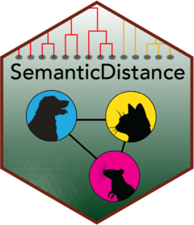
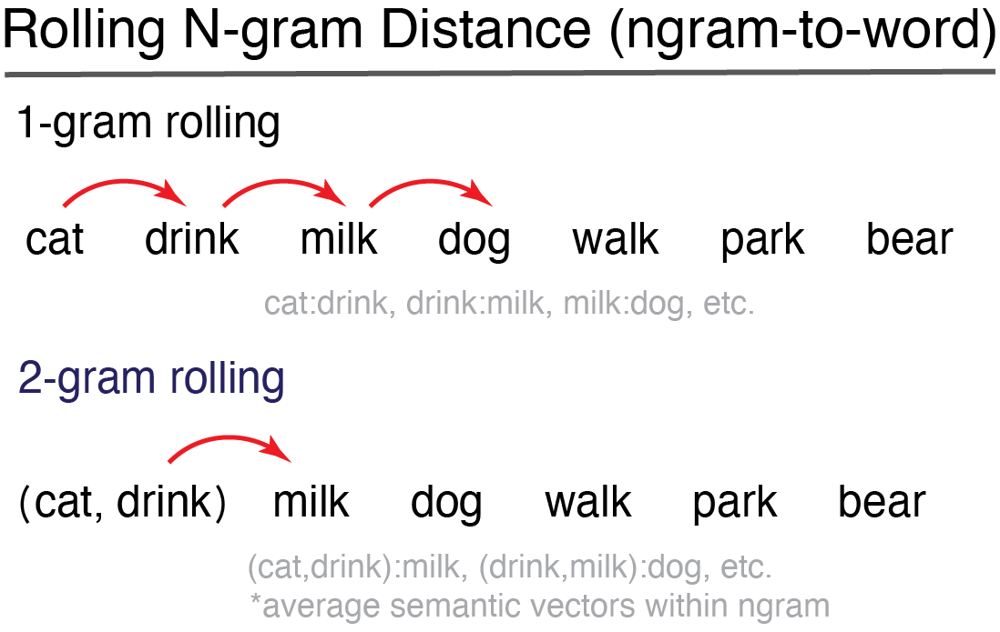
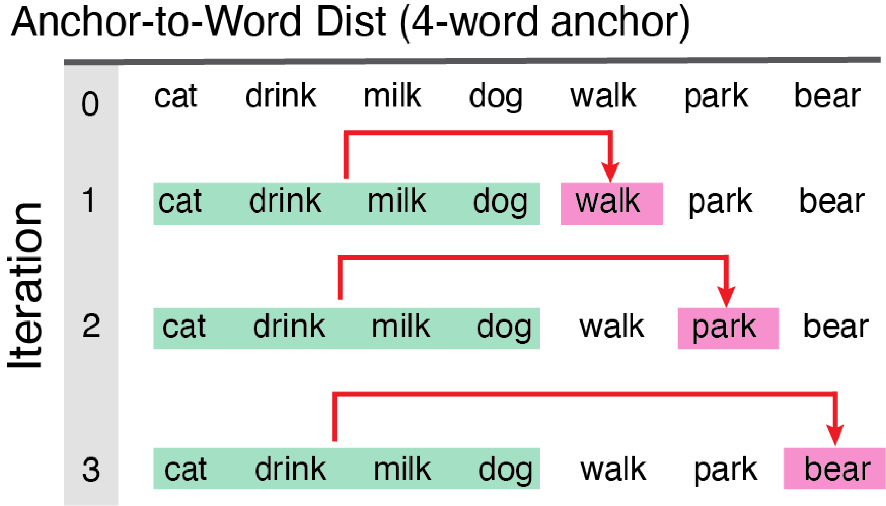
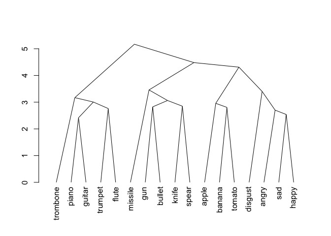
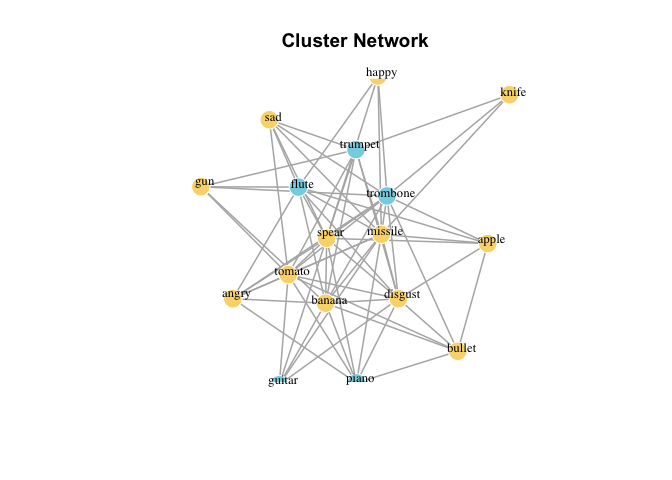

<!-- README.md is generated from README.Rmd. Please edit that file -->

<br> <br> <br>

<h1 style="color: #8B0000;">

SemanticDistance
</h1>

Compute Semantic Relatedness between Constituents of Sequential
Continuous Text

# <a href="https://reilly-conceptscognitionlab.github.io/SemanticDistance/"></a>

<div style="clear: both; margin-top: 30px;">

</div>

<div style="display: flex; gap: 10px; flex-wrap: wrap; margin-bottom: 15px;">

[](https://github.com/Reilly-ConceptsCognitionLab/SemanticDistance/releases)
[](https://www.gnu.org/licenses/gpl-3.0)

</div>

# Overview

`SemanticDistance` executes the following operations: <br> 1) cleans and
formats ordered text (monologues and dialogues) <br> 2) cleans and
formats unordered word lists (e.g., bags-of-words) <br> 3) computes
pairwise semantic distance metrics using numerous chunking options <br>
4) finds clustering solutions and creates simple semantic networks from
given word list vectors. <br>

# Install & Load Package

Install the development version of `SemanticDistance` using the
`devtools` package. <br>

``` r
#devtools::install_github("Reilly-ConceptsCognitionLab/SemanticDistance")
library(SemanticDistance)
```

# <span style="color: #8B0000; font-size: 1.1em; font-weight: bold;">Step 1: Identify Your Data Structure</span>

`SemanticDistance` contains specialized functions for processing the
text formats delineated to follow. To learn more about the specific
options for string cleaning, computing distances, and visualizing output
for each of these formats, visit its corresponding vignette. <br>

## Monologue (example)

<div style="float: right; width: 55%; margin-left: 25px; margin-bottom: 15px; padding-left: 15px; border-left: 1px solid #eee;">

| mytext |
|:---|
| The girl walked down the street. The wrestler punched the boxer. I could not open the door. 95 dogs jumped on me. |

</div>

A monologue for our purposes consists of any block of text NOT
delineated by a talker/speaker. This includes ordered texts like stories
or narratives, or unordered lists (i.e., bags of words). The minimum
requirement for a monologue is one row and one column with some text in
it. Here’s a sample monologue. <br>

<div style="clear: both; margin-bottom: 20px;">

</div>

## Dialogue (example)

<div style="float: right; width: 55%; margin-left: 25px; margin-bottom: 15px; padding-left: 15px; border-left: 1px solid #eee;">

| text                           | speaker |
|:-------------------------------|:--------|
| Hi Peter. It’s nice to see you | Mary    |
| Hi Mary. Hot out today         | Peter   |
| It sure is.                    | Mary    |
| Did you read that book?        | Peter   |
| No I haven’t had time.         | Mary    |

</div>

A dialogue is an ordered language sample split by a
talker/speaker/interlocutor factor. The minimum requirement for
formatting dialogues is to supply a dataframe with two columns. One
column is delineated by a speaker_id (e.g., name, speaker, talker) and
the second column should contain the speaker’s corresponding text
output. Above you will see a sample dialogue formatted correctly for all
proceeding steps of `SemanticDistance`.

<div style="clear: both; margin-bottom: 20px;">

</div>

## Word Pairs in Columns (example)

<div style="float: right; width: 55%; margin-left: 25px; margin-bottom: 15px; padding-left: 15px; border-left: 1px solid #eee;">

| word1 | word2     |
|:------|:----------|
| Dog   | trumpet   |
| the   | BANANA    |
| rat   | astronaut |
| \*&^% | lizard    |
| bird  | bird      |
| shark | shark     |

</div>

Word pairs arrayed as vectors within columns. The minimum requirment is
two columns with at least one row of paired data (e.g., dog, leash).
Here’s a sample dataframe of word pairs formatted correctly for all
proceeding steps of `SemanticDistance`.

<div style="clear: both; margin-bottom: 30px;">

</div>

<br>

## Unordered Word List (example)

<div style="float: right; width: 55%; margin-left: 25px; margin-bottom: 15px; padding-left: 15px; border-left: 1px solid #eee;">

| mytext |
|:---|
| trumpet trombone flute piano guitar gun knife missile bullet spear apple banana tomato sad angry happy disgusted |

</div>

An unordered bag of words. You needn’t split your text but okay if you
do. Here’s a sample dataframe. You would use this format for analyzing
structure and network properties using dendrogram or network options.

<div style="clear: both; margin-bottom: 30px;">

</div>

<br>

# <span style="color: #8B0000; font-size: 1.2em; font-weight: bold;">Step 2 Clean and Format Data</span>

Transforms text to lowercase then optionally clean (omit stopwords, omit
non-alphabetic chars), lemmatize (transforms morphological derivatives
of words to their standard dictionary entries), and split multiword
utterances into a one-word-per row format.

## Clean Monologue or Unordered Word List

## `clean_monologue_or_list`

<span style="color: #006400;">Arguments to
`clean_monologue_or_list`</span><br> -`dat` raw dataframe with at least
one column of text. <br> -`wordcol` quoted variable column name where
your target text lives (e.g., ‘mytext’) <br> -`omit_stops` omits
stopwords, T/F default is TRUE. <br> -`lemmatize` transforms raw word to
lemmatized form, T/F default is TRUE. <br>

``` r
Monologue_Cleaned <- clean_monologue_or_list(dat=Monologue_Typical, wordcol='mytext', omit_stops=TRUE, lemmatize=TRUE)
knitr::kable(head(Monologue_Cleaned, 12), format = "pipe", digits=2)
```

| id_row_orig | text_initialsplit | word_clean | id_row_postsplit |
|:------------|:------------------|:-----------|-----------------:|
| 1           | the               | NA         |                1 |
| 1           | girl              | girl       |                2 |
| 1           | walked            | walk       |                3 |
| 1           | down              | down       |                4 |
| 1           | the               | NA         |                5 |
| 1           | street.           | street     |                6 |
| 1           | the               | NA         |                7 |
| 1           | wrestler          | wrestler   |                8 |
| 1           | punched           | punch      |                9 |
| 1           | the               | NA         |               10 |
| 1           | boxer.            | boxer      |               11 |
| 1           | i                 | NA         |               12 |

## Clean Dialogue Transcripts

## `clean_dialogue`

<span style="color: #006400;">Arguments to `clean_dialogue`</span><br>
-`dat` your raw dataframe with at least one column of text AND a talker
column. <br> -`wordcol` column name (quoted) containing the text you
want cleaned. <br> -`whotalks` column name (quoted) containing the
talker ID (will convert to factor). <br> -`omit_stops` omits stopwords,
T/F default is TRUE. <br> -`lemmatize` transforms raw word to lemmatized
form, T/F default is TRUE.

``` r
Dialogue_Cleaned <- clean_dialogue(dat=Dialogue_Typical, wordcol="text", who_talking = "speaker", omit_stops=TRUE, lemmatize=TRUE)
knitr::kable(head(Dialogue_Cleaned, 12), format = "pipe", digits=2)
```

| id_row_orig | text_initialsplit | speaker | word_clean | id_row_postsplit | turn_count |
|:------------|:------------------|:--------|:-----------|-----------------:|-----------:|
| 1           | hi                | Mary    | NA         |                1 |          1 |
| 1           | peter             | Mary    | peter      |                2 |          1 |
| 1           | its               | Mary    | NA         |                3 |          1 |
| 1           | its               | Mary    | NA         |                4 |          1 |
| 1           | nice              | Mary    | nice       |                5 |          1 |
| 1           | to                | Mary    | NA         |                6 |          1 |
| 1           | see               | Mary    | see        |                7 |          1 |
| 1           | you               | Mary    | NA         |                8 |          1 |
| 2           | hi                | Peter   | NA         |                9 |          2 |
| 2           | mary              | Peter   | mary       |               10 |          2 |
| 2           | hot               | Peter   | hot        |               11 |          2 |
| 2           | out               | Peter   | out        |               12 |          2 |

## Clean/Format Word Pairs in Columns

## `clean_paired_cols`

Your data for computing pairwise semantic distance are arrayed in two
paired columns in a dataframe. These columns need not be adjacent. You
will specify their variable names in the function call. <br>

<span style="color: #006400;">Arguments to
`clean_paired_cols`</span><br> -`dat` your raw dataframe with two
columns of paired text. <br> -`word1` quoted variable reflecting the
column name where your first word lives. <br> -`word2` quoted variable
reflecting the column name where your first word lives. <br>
-`lemmatize` transforms raw word to lemmatized form, T/F default is
TRUE. <br>

``` r
WordPairs_Clean <- clean_paired_cols(dat=Word_Pairs, wordcol1='word1', wordcol2='word2', lemmatize=TRUE)
knitr::kable(head(WordPairs_Clean, 6), format = "simple", digits=2) 
```

| id_row_orig | word1_clean | word2_clean | word1 | word2     |
|:------------|:------------|:------------|:------|:----------|
| 1           | dog         | trumpet     | Dog   | trumpet   |
| 2           | the         | banana      | the   | BANANA    |
| 3           | rat         | astronaut   | rat   | astronaut |
| 5           | bird        | bird        | bird  | bird      |
| 6           | shark       | shark       | shark | shark     |
| 8           | dog         | leash       | Dog   | leash     |

<br> <br>

# <span style="color: #8B0000; font-size: 1.2em; font-weight: bold;">Step 3: Compute Semantic Distance</span>

Now compute semantic distance for your selected format from one of the
options below. <br>

## Ngram-to-Word Distance

## `dist_ngram2word`

This function works on monologues (continuous ordered samples) only!
Computes cosine distance using a rolling ngram approach consisting of
groups of words (ngrams) to the next word. *IMPORTANT* the function
looks backward from the target word skipping over NAs until filling the
desired ngram size.<br>

<span style="color: #006400;">Arguments to `dist_ngram2word`:</span><br>
-`dat` dataframe of a monologue transcript cleaned and prepped. <br>
-`ngram` window size preceding each new content word. <br>

<figure>

<figcaption aria-hidden="true">rolling groupings of words</figcaption>
</figure>

``` r
Ngram2Word_Dists1 <- dist_ngram2word(dat=Monologue_Cleaned, ngram=1) #distance word-to-word
knitr::kable(head(Ngram2Word_Dists1, 8), format = "pipe", digits = 2)
```

| id_row_orig | text_initialsplit | word_clean | id_row_postsplit | CosDist_1gram_glo | CosDist_1gram_sd15 |
|:---|:---|:---|---:|---:|---:|
| 1 | the | NA | 1 | NA | NA |
| 1 | girl | girl | 2 | NA | NA |
| 1 | walked | walk | 3 | 0.47 | 1.06 |
| 1 | down | down | 4 | 0.28 | 0.80 |
| 1 | the | NA | 5 | NA | NA |
| 1 | street. | street | 6 | 0.36 | 0.87 |
| 1 | the | NA | 7 | NA | NA |
| 1 | wrestler | wrestler | 8 | 0.97 | 0.63 |

<br> <br>

## Ngram-to-Ngram Distance

## `dist_ngram2ngram`

This function works on monologues (continuous ordered samples) only.
User specifies n-gram size (e.g., ngram=2). Distance computed from each
two-word chunk to the next iterating all the way down the dataframe
until there are no more words to ‘fill out’ the last ngram. <br>

<span style="color: #006400;">Arguments to `dist_ngram2ngram`</span><br>
-`dat` dataframe w/ a monologue sample cleaned and prepped <br> -`ngram`
chunk size (chunk-to-chunk), (e.g., ngram=2 means chunks of 2 words
compared to the next chunk of two words). <br>

<figure>

<figcaption aria-hidden="true">chunk-to-chunk groupings of
words</figcaption>
</figure>

``` r
Ngram2Ngram_Dist1 <- dist_ngram2ngram(dat=Monologue_Cleaned, ngram=2)
knitr::kable(head(Ngram2Ngram_Dist1, 8), format = "pipe", digits = 2)
```

| id_row_orig | text_initialsplit | word_clean | id_row_postsplit | CosDist_2gram_GLO | CosDist_2gram_SD15 |
|:---|:---|:---|---:|---:|---:|
| 1 | the | NA | 1 | NA | NA |
| 1 | girl | girl | 2 | NA | NA |
| 1 | walked | walk | 3 | NA | NA |
| 1 | down | down | 4 | 0.14 | 1.05 |
| 1 | the | NA | 5 | 0.06 | 0.09 |
| 1 | street. | street | 6 | 0.32 | 0.94 |
| 1 | the | NA | 7 | 0.32 | 0.94 |
| 1 | wrestler | wrestler | 8 | 0.93 | 1.18 |

<br> <br>

## Anchor-to-Word Distance

## `dist_anchor`

This function works on monologues (continuous ordered samples) only!
Models semantic distance from each successive new word to the average of
the semantic vectors for the first block of N content words. This
anchored distance provides a metric of overall semantic drift as a
language sample unfolds relative to a fixed starting point.<br>

<span style="color: #006400;">Arguments to `dist_anchor`</span><br>
-`dat` dataframe monologue sample cleaned and prepped using
`clean_monologue`. <br> -`anchor_size` size of the initial chunk of
words for chunk-to-new-word comparisons. <br>

<figure>

<figcaption aria-hidden="true">fixed initial chunk of words to each new
word or ngram</figcaption>
</figure>

``` r
Anchored_Dists1 <- dist_anchor(dat=Monologue_Cleaned, anchor_size=8)
knitr::kable(head(Anchored_Dists1, 4), format = "pipe", digits = 2)
```

| id_row_postsplit | word_clean | CosDist_Anchor_GLO | CosDist_Anchor_SD15 |
|-----------------:|:-----------|-------------------:|--------------------:|
|                1 | NA         |                 NA |                  NA |
|                2 | girl       |               0.26 |                0.42 |
|                3 | walk       |               0.16 |                0.19 |
|                4 | down       |               0.12 |                0.27 |

<br>

## Turn-to-Turn Distance

## `dist_dialogue`

This function works on dialogue transcripts only!!! Averages semantic
vectors for all content words in each speaker’s turn then computes the
cosine distance to the average of the semantic vectors of the content
words in the subsequent turn. <br>

<span style="color: #006400;">Arguments to `dist_dialogue`:</span> <br>
-`dat` dataframe w/ a dialogue sample cleaned and prepped using
`clean_dialogue`. <br> -`who_talking` quoted argument specifying 2-level
factor variable name for person producing given text. <br>

``` r
DialogueDists <- dist_dialogue(dat=Dialogue_Cleaned, who_talking='speaker')
knitr::kable(head(DialogueDists, 4), format = "pipe", digits = 2)
```

| turn_count | speaker | n_words | glo_cosdist | sd15_cosdist |
|-----------:|:--------|--------:|------------:|-------------:|
|          1 | Mary    |       3 |        0.83 |         0.58 |
|          2 | Peter   |       4 |        0.85 |         0.58 |
|          3 | Mary    |       1 |        0.86 |         0.58 |
|          4 | Peter   |       3 |        0.86 |         0.45 |

<br>

## Word Pair Distance

## `dist_paired_cols`

This function works on word pairs in columns only!!! Output of
`dist_paired_cols` on 2-column arrayed dataframe. <br>

<span style="color: #006400;">Arguments to `dist_paired_cols`</span>
<br> -`dat` dataframe w/ word pairs arrayed in columns cleaned and
prepped.

``` r
Columns_Dists <- dist_paired_cols(WordPairs_Clean) #only argument is dataframe
knitr::kable(head(Columns_Dists, 6), format = "pipe", digits = 2)
```

| id_row_orig | word1_clean | word2_clean | word1 | word2     | CosDist_SD15 | CosDist_GLO |
|:------------|:------------|:------------|:------|:----------|-------------:|------------:|
| 1           | dog         | trumpet     | Dog   | trumpet   |         0.45 |        0.84 |
| 2           | the         | banana      | the   | BANANA    |         1.18 |        0.77 |
| 3           | rat         | astronaut   | rat   | astronaut |         1.22 |        0.93 |
| 5           | bird        | bird        | bird  | bird      |         0.00 |        0.00 |
| 6           | shark       | shark       | shark | shark     |         0.00 |        0.00 |
| 8           | dog         | leash       | Dog   | leash     |         0.68 |        0.50 |

<br> <br> <br>

# <span style="color: #8B0000; font-size: 1.1em; font-weight: bold;">Data Visualization Options for Semantic Networks</span>

Choose your visualization option based on the nature of your data. An
temporally ordered text such as a story can be plotted like a time
series. This would not make sense for Unordered lists (bags-of-words).
However, with word lists you might be interested in using scaling
procedures to find latent structure or similarities. `SemanticDistance`
has two options for computing clustering and network properties for a
vector of words, i.e., hierarchical clustering and simple network
visualization. The function also returns a square matrix with all
pairwise semantic distance values for a word list. <br>

## Hierarchical Cluster Dendrogram

## `wordlist_to_network`

Produces a dendogram from a vector of words. First pulls words, then
creates a square matrix with cosine distances for all possible word
pairs: d\[i,j\]. Then converts semantic distance matrix to Euclidean
distance. Then plots a hierchcial clustering solution moving words
closer together in proximity based on their distance. Works best for
unordered word lists. <br>

<span style="color: #006400;">Arguments to
`wordlist_to_network`:</span><br> -`dat` dataframe processed using
`clean_monologue_or_list()` <br> -`output` quoted argument `dendrogram`
or `network` default is `dendrogram`. <br> -`dist_type` quoted argument,
which distance norms would you like? default is `embedding` alternative
is `SD15`. <br>

``` r
MyCleanList <- clean_monologue_or_list(dat=Unordered_List, wordcol='mytext')
mydendro <- wordlist_to_network(MyCleanList, output='dendrogram', dist_type='embedding')
#> [1] "Length of words: 17"
#> [1] "my_kmax: 10"
```



``` r
print(mydendro)
#> 'dendrogram' with 2 branches and 17 members total, at height 5.168642
```

## iGraph network (graph plot)

## `clean_monologue_or_list`

Produces a dendogram from a vector of words. First pulls words, then
creates a square matrix with cosine distances for all possible word
pairs: d\[i,j\]. Then converts semantic distance matrix to Euclidean
distance. Then plots a hierchcial clustering solution moving words
closer together in proximity based on their distance. Works best for
unordred word lists cleaned with clean_monologues(). <br>

<span style="color: #006400;">Arguments to
`clean_monologue_or_list`</span> <br> -
dat`input formatted dataframe. <br> -`dist_type`quoted argument distance option, default is "embedding", alt is`SD15\`.
<br>

``` r
MyCleanList <- clean_monologue_or_list(dat=Unordered_List, wordcol='mytext')
mynetwork <- wordlist_to_network(MyCleanList, output='network', dist_type='embedding')
#> [1] "Length of words: 17"
#> [1] "my_kmax: 10"
```



``` r
print(mynetwork)
#> IGRAPH ad5f728 UNW- 17 68 -- 
#> + attr: name (v/c), cluster (v/n), color (v/c), size (v/n), label
#> | (v/c), label.color (v/c), label.cex (v/n), weight (e/n), color (e/c),
#> | width (e/n)
#> + edges from ad5f728 (vertex names):
#>  [1] trombone--missile trombone--gun     trombone--bullet  trombone--knife  
#>  [5] trombone--spear   trombone--apple   trombone--banana  trombone--tomato 
#>  [9] trombone--disgust trombone--angry   trombone--sad     trombone--happy  
#> [13] piano   --missile piano   --bullet  piano   --spear   piano   --banana 
#> [17] piano   --tomato  piano   --disgust piano   --angry   guitar  --missile
#> [21] guitar  --spear   guitar  --banana  guitar  --tomato  guitar  --disgust
#> + ... omitted several edges
```

# Getting Help

For bugs, feature requests, and general questions, reach out via one of
the following options: <br> 1. [Report
Bugs](https://github.com/Reilly-ConceptsCognitionLab/SemanticDistance/issues)
<br> 2. [View
Discussions](https://github.com/Reilly-ConceptsCognitionLab/SemanticDistance/discussions)
<br> 3. [Read News and Release
Notes](https://github.com/Reilly-ConceptsCognitionLab/SemanticDistance/blob/main/NEWS.md).
<br> <br>

If none of these options do the trick, please email the package
maintainer, [Jamie Reilly](mailto:reillyj@temple.edu) for assistance.
