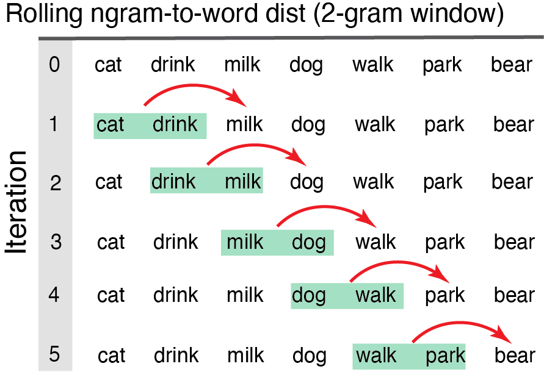
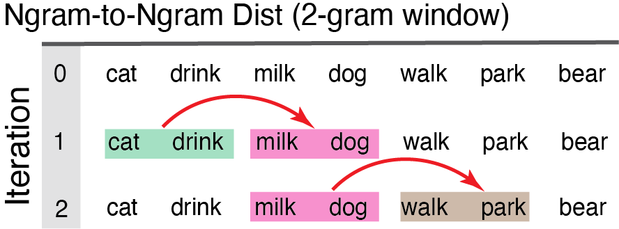

<!-- README.md is generated from README.Rmd. Please edit that file -->


<br/>

<!-- badges: start -->

[](https://github.com/Reilly-ConceptsCognitionLab/SemanticDistance/actions/workflows/R-CMD-check.yaml)
<!-- badges: end -->

## Before Starting

SemanticDistance nominally requires a dataframe with at least one column
variable and one row of text. The package is capable of processing many
more dataframe formats (e.g., word pairs arrayed in columns,
conversation transcripts, unordered word lists). SemanticDistance will
retain all of your original metadata after splitting/unlisting your text
into a one-word-per-row structure. This sequential structure is ideal
for joining distance values to timestamps and other variables as
language unfolds (e.g., reaction time, pupil diameter).

## Install & Load

Install the development version of SemanticDistance from
[GitHub](https://github.com/) using devtools.

``` r
#install.packages("devtools")
#devtools::install_github("Reilly-ConceptsCognitionLab/SemanticDistance")
library(SemanticDistance)
```

## Data Compatibility

Sometimes you care about computing time-ordered semantic distances
between words in running discourse sampples. Other times word order
doesn’t matter (e.g., using a simple machine learning algorithm to
cluster a bag of words by similarity). Sometimes your data will be
structured as monologues (e.g., stories, narratives). Other times you
might be interested in computing semantic distance turn-by-turn across
speakers in a conversation transcript (i.e., dialogue). The
SemanticDistance pockage can handle all of these scenarios. However, is
is important that **you** understand the structure of your data and what
the distance measures mean.<br/>

Here are the formats SemanticDistance can currently handle: <br/> 1.
**Monologues**: A monologue transcript consists of any ordered text
sample NOT delineated by a talker/speaker (e.g., stories, narratives).
The minimal requirement for a monologue is one row and one column with
some text in it.<br/> 2. **Dialogues**: A dialogue transcript includes
any sample split by talker/speaker/interlocutor information including
conversation transcripts. The minimum requirment is two cells with
interlocutor identity and text.<br/> 3. **Word Pairs in Columns**: A
dataframe that contains two columns of paired string data (col1
vs. col2). Calculates distance between each word pair across columns
(e.g., Dog-Leash). <br/> 4. **Unordered Word Lists**: A dataframe with
an unordered list of words (nominally one column, all text in one row)
that will be transformed into a distance matrix and hierarchically
clustered <br/>

## Sample language transcripts embedded in the package

SemanticDistance contains some sample language transcripts that will
automatically load when you call the package. These can be helpful for
evaluating and debugging your own own data.<br/>

1.  **Monologue_Structured:** Dataframe 1-word per row already split no
    missing observations <br/>
2.  **Monologue_Dirty:** Dataframe text arrayed in one column ‘mytext’,
    missing observations, junk, multiword phrases contains metadata
    (simulated timestamps <br/>
3.  **Monologue_VerbalFluency:** Dataframe ordered simulated semantic
    fluency data switching between categories every ten words (animals,
    tools, musical instruments, fruits)
4.  **Dialogue_Structured:** Dataframe simulating ‘perfect’ conversation
    transcript, one word per turn, two talkers
5.  **Dialogue_Dirty:** Dataframe simulating ‘dirty’ conversation
    transcript, multiple lines per person, lots of stopwords, missing
    obervations, stray transcription symbols <br/>
6.  **WordPairs_Columns:** Dataframe with word pairs arrayed in two
    columns <br/>
7.  **WordList_TestClustering:** Unordered unsplit word list, some junk
    and also animal and weapon terms for hierachical clustering analysis
    <br/> <br/> <br/>

# <span style="color: darkred;">—Step 1: Cleaning— </span>

First identify the type of data structure you want to process (e.g.,
monologue, dialogue, unordered list). The semantic distance functions
work by indexing unique numeric identifiers. You **MUST** first
clean/prep your raw text to append these identifers. Prepare your
lexical data for computing pairwise semantic distances by first doing
the following: <br/> 1) Read your data into R. Label your text and
metadata columns however you like. <br/> 2) Your dataframe should
contain at least one column with the target string data (e.g., mytext).
<br/> 3) Identify the format of your sample (e.g., monologue, dialogue,
columns, unstructured). <br/> 4) Decide on your cleaning parameters
(lemmatize, omit stopwords, omit punctuation). <br/> 5) Run the
approproate cleaning function specifying the parameters that best fit
your data and aims. <br/> <br/>

## <span style="color: brown;">1.1 Clean Monologue Transcript (clean_monologue)</span>

Clean a monologue transcript by calling the ‘clean_monologue’ function.
Specific arguments include: <br/>

<Link Here for Examples of Cleaning Monologues> <br/>

**df** = raw dataframe with at least one column of text <br/>
**wordcol** = quoted variable column name where your target text lives
(e.g., ‘mytext’) <br/> **clean** = applies cleaning functions (e.g.,
punct out, lowercase, etc); default is TRUE <br/> **omit_stops** = omits
stopwords, default is TRUE <br/> **lemmatize** = transforms raw word to
lemmatized form, default is TRUE <br/> **split_strings** = T/F (default
is T) option to split multiword utterances into separate rows <br/>

Output of ‘clean_monologue’ on a messy monologue transcript. Note that
there will be three ’ID” variables appended to your cleaned dataframe
and one column variable marking who produced the language output. These
include: <br/> 1. **id_row_orig** a numeric identifier marking the
original row where a word or group of words appeared. 2. **id_turn**, 3.
**’id_row_postsplit** a unique identifier marking each word’s ordered
position in the dataframe after splitting multiword utterances across
rows. This ID variable is needed for joining. 4. **talker** identity of
the speaker who produced each word <br/>

Note that SemanticDistance requires a one word per row format. If you do
not split strings, the program will squish all your separate strings in
a row into one frankenword before moving on to compute distance,
split_strings=F should only be used when you have already formatted your
dataframe into a one word per row format and you absolutetly do not want
to expand contractions, omit stopwords. This almost never is the case so
you can generally just leave split_strings in its default state (TRUE).

``` r
#text in this dataframe is in a column 'mytext'
Monologue1_Clean <- clean_monologue(Monologue_Dirty, wordcol='mytext', clean=T, omit_stops=T)
head(Monologue1_Clean)
#> # A tibble: 6 × 4
#>   id_row_orig word_clean mytext           id_row_postsplit
#>   <fct>       <chr>      <chr>                       <int>
#> 1 1           <NA>       The dog is blue.                1
#> 2 1           dog        The dog is blue.                2
#> 3 1           <NA>       The dog is blue.                3
#> 4 1           blue       The dog is blue.                4
#> 5 2           dog        Dog                             5
#> 6 3           dog        Dog                             6
```

Output of ‘clean_monologue’ on a structured monologue transcript

``` r
#text in this dataframe is in a column 'mytext'
Monologue2_Clean <- clean_monologue(Monologue_Structured, wordcol='mytext', omit_stops=TRUE, clean=TRUE, split_strings=TRUE)
head(Monologue2_Clean, n=10)
#> # A tibble: 10 × 5
#>    id_row_orig word_clean timestamp mytext    id_row_postsplit
#>    <fct>       <chr>          <int> <chr>                <int>
#>  1 1           <NA>               1 "the"                    1
#>  2 2           girl               2 "girl"                   2
#>  3 3           walk               3 "walked"                 3
#>  4 4           down               4 "down "                  4
#>  5 5           <NA>               5 "the "                   5
#>  6 6           street             6 "street"                 6
#>  7 7           <NA>               7 "the"                    7
#>  8 8           boxer              8 "boxer"                  8
#>  9 9           punch              9 "punched"                9
#> 10 10          <NA>              10 "the"                   10
```

<br/> <br/>

## <span style="color: brown;">1.2 Clean Dialogue Transcripts (clean_dialogue)</span>

This could be a conversation transcript or any language sample where you
care about talker/interlocutor information (e.g., computing semantic
distance across turns in a conversation). Your dataframe should
nominally contain a text column and a speaker/talker column. Arguments
clean_dialogue are: <br/> **df** = your raw dataframe with at least one
column of text AND a talker column <br/> **wordcol** = column name
(quoted) containing the text you want cleaned <br/> **whotalks** =
column name (quoted) containing the talker ID (will convert to factor)
<br/> **clean** = T/F (default is T) applies cleaning functions <br/>
**omit_stops** = T/F omits stopwords, default is TRUE <br/>
**lemmatize** = T/F transforms raw word to lemmatized form, default is
TRUE <br/>

<Link Here for Examples of Cleaning Dialogues> <br/>

Output of ‘clean_dialogue’ fn on prepping a well-structured dialogue
transcript

``` r
Dialogue1_Clean <- clean_dialogue(Dialogue_Structured, wordcol="mytext", whotalks = "speaker", clean=TRUE, omit_stops=TRUE, lemmatize=TRUE, split_strings=TRUE)
head(Dialogue1_Clean, n=8)
#> # A tibble: 8 × 7
#>   id_row_orig word_clean mytext    speaker talker id_row_postsplit id_turn
#>   <fct>       <chr>      <chr>     <chr>   <fct>             <int>   <dbl>
#> 1 1           donkey     donkey    P1      P1                    1       1
#> 2 2           astronaut  astronaut P2      P2                    2       2
#> 3 3           bubble     bubble    P1      P1                    3       3
#> 4 4           street     street    P2      P2                    4       4
#> 5 5           pigeon     Pigeon    P1      P1                    5       5
#> 6 6           dolphin    Dolphin   P2      P2                    6       6
#> 7 7           eagle      Eagle     P1      P1                    7       7
#> 8 8           eel        eel       P2      P2                    8       8
```

Output of ‘clean_dialogue’ fn on prepping a messy dialogue transcript

``` r
Dialogue2_Clean <- clean_dialogue(Dialogue_Dirty, wordcol="word", whotalks = "speaker", clean=TRUE, omit_stops=TRUE, lemmatize=TRUE, split_strings=TRUE)
head(Dialogue2_Clean, n=20)
#> # A tibble: 20 × 7
#>    id_row_orig word_clean word           speaker talker id_row_postsplit id_turn
#>    <fct>       <chr>      <chr>          <chr>   <fct>             <int>   <dbl>
#>  1 1           <NA>       Hi Peter       Mary    Mary                  1       1
#>  2 1           peter      Hi Peter       Mary    Mary                  2       1
#>  3 2           donkey     Donkeys are g… Mary    Mary                  3       1
#>  4 2           <NA>       Donkeys are g… Mary    Mary                  4       1
#>  5 2           gray       Donkeys are g… Mary    Mary                  5       1
#>  6 3           leopard    Leopard        Mary    Mary                  6       1
#>  7 4           pop        pop goes the … Mary    Mary                  7       1
#>  8 4           go         pop goes the … Mary    Mary                  8       1
#>  9 4           <NA>       pop goes the … Mary    Mary                  9       1
#> 10 4           weasel     pop goes the … Mary    Mary                 10       1
#> 11 5           pigeon     Pigeon         Mary    Mary                 11       1
#> 12 6           dolphin    Dolphin        Mary    Mary                 12       1
#> 13 7           eagle      Eagle          Mary    Mary                 13       1
#> 14 8           <NA>       Hi Mary        Peter   Peter                14       2
#> 15 8           mary       Hi Mary        Peter   Peter                15       2
#> 16 9           like       I like eels    Peter   Peter                16       2
#> 17 9           eel        I like eels    Peter   Peter                17       2
#> 18 10          beagle     Beagle         Peter   Peter                18       2
#> 19 11          cow        Cow            Mary    Mary                 19       3
#> 20 12          tiger      Tiger          Peter   Peter                20       4
```

<br/> <br/>

## <span style="color: brown;">1.3 Clean Word Pairs Arrayed in Columns (clean_2columns)</span>

SemanticDistance also computes pairwise distance for data arrayed in
columns. Run the function, the cleaned columns will appear in the
dataframe. Arguments to the ‘clean_monologue’ function call are: <br/>

**df** = your raw dataframe with at least one column of text <br/>
**word1** = quoted variable reflecting the column name where your first
word lives <br/> **word2** = quoted variable reflecting the column name
where your first word lives <br/> **clean** = T/F (default is T) applies
cleaning functions <br/> **omit_stops** = T/F omits stopwords, default
is TRUE <br/> **lemmatize** = T/F transforms raw word to lemmatized
form, default is TRUE <br/>

<Link Here for More Examples of Cleaning Word Pairs in Columns> <br/>

Output of ‘clean_2columns’ word pairs arrayed in columns

``` r
Columns1_Clean <- clean_2cols(WordPairs_Columns, 'word1', 'word2', clean=TRUE, omit_stops=TRUE, lemmatize=TRUE)
head(Columns1_Clean, n=8) #view head cleaned data
#>   word1     word2 id_row_orig word1_clean1 word2_clean2
#> 1   dog   trumpet           1          dog      trumpet
#> 2   the    banana           2         <NA>       banana
#> 3   rat astronaut           3          rat    astronaut
#> 4  *&^%    lizard           4         <NA>       lizard
#> 5  bird      bird           5         bird         bird
#> 6 shark     shark           6        shark        shark
#> 7 table     38947           7        table         <NA>
#> 8   dog     leash           8          dog        leash
```

<br/> <br/>

## <span style="color: brown;">1.4 Clean Unordered Word List (clean_unordered)</span>

This cleaning option is used for prepping a vector of words for
hierarchical clustering. Word order is no longer a factor since all
words will be shuffled. This cleaning function retains only one instance
of a word (no duplicates). Arguments to the ‘clean_unordered’ function
call are: <br/>

**df** = your raw dataframe with at least one column of text <br/>
**wordcol** = quoted variable reflecting where your text lives <br/>
**clean** = T/F (default is T) applies cleaning functions <br/>
**omit_stops** = T/F omits stopwords, default is TRUE <br/>
**lemmatize** = T/F transforms raw word to lemmatized form, default is
TRUE <br/>

<Link Here for More Examples of Cleaning Unordered Word Lists> <br/>

Output of ‘clean_unordered’ on unordered word list

``` r
#Run clean fn 
Unordered1_Clean <- clean_unordered(WordList_TestClustering, wordcol="mytext", clean=TRUE, omit_stops=TRUE, lemmatize=TRUE) 
head(Unordered1_Clean)
#> # A tibble: 6 × 4
#>   id_row_orig word_clean mytext                                 id_row_postsplit
#>   <fct>       <chr>      <chr>                                             <int>
#> 1 1           dog        dog cat $ Rat gun banana the sword ta…                1
#> 2 1           cat        dog cat $ Rat gun banana the sword ta…                2
#> 3 1           rat        dog cat $ Rat gun banana the sword ta…                3
#> 4 1           gun        dog cat $ Rat gun banana the sword ta…                4
#> 5 1           banana     dog cat $ Rat gun banana the sword ta…                5
#> 6 1           <NA>       dog cat $ Rat gun banana the sword ta…                6
```

<br/> <br/>

# <span style="color: darkred;">–Step 2: Compute Semantic Distance–</span>

SemanticDistance will append cosine distance values between each pair of
elements specified by the user (e.g., word-to-word, ngram-to-word).
These distance values are derived from two large lookup databases in the
package with fixed semantic vectors for \>70k English words. CosDist_Glo
reflects cosine distance between vectors derived from training a GLOVE
word embedding model (300 hyperparameters per word). CodDist_SD15
refects cosine distance between two chunks (words, groups of words)
characterized across 15 meaningful perceptual and affective dimensions
(e.g., color, sound, valence). <br/> <br>

## <span style="color: brown;">2.1: Compute Ngram-to-Word Distance (dist_ngram2word)</span>

Computes cosine distance for two models (embedding and experiential)
using a rolling ngram approach consisting of groups of words (ngrams) to
the next word. *IMPORTANT* the way this works is that the function rolls
backward from the target word skipping over NAs until filling the
desired ngram size. It does not do the same procedure for filling
forward. If you evaluate a row with an NA it will look backward until
finding n real words and then produce an NA when trying to compare the
ngram to the target word (because there is no target word for that row).
<br/>

<Link Here for More Examples of Computing Rolling Ngram2Word Distance>
<br/>


<br/> <br/>

Remember to call a cleaned/prepped dataframe! Arguments to
‘dist_ngram2word’ are: <br/> \| **dat** dataframe of a monologue
transcript cleaned and prepped with clean_monologue fn <br/> \|
**ngram** window size preceding each new content word <br/>

Output ‘dist_ngram2word’ on a messy monologue

``` r
#Set the ngram=1, distance every word to the next word
Ngram2Word_Dists1 <- dist_ngram2word(Monologue1_Clean, ngram=1) #distance word-to-word
#> Loading required package: SnowballC
#> 
#> Attaching package: 'lsa'
#> The following object is masked from 'package:koRpus':
#> 
#>     query
head(Ngram2Word_Dists1, n=8)
#> # A tibble: 8 × 6
#>   id_row_orig word_clean mytext            id_row_postsplit CosDist_1gram_glo
#>   <fct>       <chr>      <chr>                        <int>             <dbl>
#> 1 1           <NA>       The dog is blue.                 1            NA    
#> 2 1           dog        The dog is blue.                 2            NA    
#> 3 1           <NA>       The dog is blue.                 3            NA    
#> 4 1           blue       The dog is blue.                 4             0.607
#> 5 2           dog        Dog                              5             0.607
#> 6 3           dog        Dog                              6             0    
#> 7 4           <NA>       Some                             7            NA    
#> 8 5           <NA>       My name is Frank.                8            NA    
#> # ℹ 1 more variable: CosDist_1gram_sd15 <dbl>
```

Output ‘dist_ngram2word’ on a well-structured monologue

``` r
#Set the ngram=3, distance rolling chunks of 3 words to the next word
Ngram2Word_Dists2 <- dist_ngram2word(Monologue2_Clean, ngram=3) #distance previous 3gram-to-word
head(Ngram2Word_Dists2, n=12)
#> # A tibble: 12 × 7
#>    id_row_orig word_clean timestamp mytext    id_row_postsplit CosDist_3gram_glo
#>    <fct>       <chr>          <int> <chr>                <int>             <dbl>
#>  1 1           <NA>               1 "the"                    1            NA    
#>  2 2           girl               2 "girl"                   2            NA    
#>  3 3           walk               3 "walked"                 3            NA    
#>  4 4           down               4 "down "                  4            NA    
#>  5 5           <NA>               5 "the "                   5            NA    
#>  6 6           street             6 "street"                 6             0.320
#>  7 7           <NA>               7 "the"                    7            NA    
#>  8 8           boxer              8 "boxer"                  8             0.865
#>  9 9           punch              9 "punched"                9             0.617
#> 10 10          <NA>              10 "the"                   10            NA    
#> 11 11          wrestler          11 "wrestle…               11             0.778
#> 12 12          open              12 "open"                  12             0.791
#> # ℹ 1 more variable: CosDist_3gram_sd15 <dbl>
```

<br/> <br/>

## <span style="color: brown;">2.2: Compute Ngram-to-Ngram Distance (dist_ngram2ngram)</span>

User specifies n-gram size (e.g., ngram=2). Distance computed from each
two-word chunk to the next iterating all the way down the dataframe
until there are no more words to ‘fill out’ the last ngram. Note this
distance function **only works on monologue transcripts** where there
are no speakers delineated and word order matters. <br/>

<Link Here for More Examples of Computing Ngram-2-Ngram Distance in Monologues>
<br/>


<br/>

Arguments to dist_ngram2ngram are: <br/> \| dat = dataframe w/ a
monologue sample cleaned and prepped <br/> \| ngram = chunk size
(chunk-to-chunk) <br/>

Output ‘dist_ngram2ngram’ on monologue transcript

``` r
#Give the function a cleaned monologue transcript, This example involves chunks of 2-words to 2-words
Ngram2Ngram_Dist1 <- dist_ngram2ngram(Monologue2_Clean, ngram=2)
head(Ngram2Ngram_Dist1, n=8)
#> # A tibble: 8 × 7
#>   id_row_orig word_clean timestamp mytext   id_row_postsplit CosDist_2gram_GLO
#>   <fct>       <chr>          <int> <chr>               <int>             <dbl>
#> 1 1           <NA>               1 "the"                   1           NA     
#> 2 2           girl               2 "girl"                  2           NA     
#> 3 3           walk               3 "walked"                3           NA     
#> 4 4           down               4 "down "                 4            0.141 
#> 5 5           <NA>               5 "the "                  5            0.0608
#> 6 6           street             6 "street"                6            0.319 
#> 7 7           <NA>               7 "the"                   7            0.319 
#> 8 8           boxer              8 "boxer"                 8            0.839 
#> # ℹ 1 more variable: CosDist_2gram_SD15 <dbl>
```

<br/> <br/>

## <span style="color: brown;">2.3: Turn-by-Turn Distance (dist_dialogue)</span>

Averages the semantic vectors for all content words in a turn then
computes the cosine distance to the average of the semantic vectors of
the content words in the subsequent turn. Note: this function only works
on dialogue samples marked by a talker variable (e.g., conversation
transcripts). It averages across the semantic vectors of all words
within a turn and then computes cosine distance to all the words in the
next turn. You just need to feed it a transcript formattef with
clean_dialogue.<br/>

<Link Here for More Examples of Computing Turn-2-Turn Distance in Dialogues>
<br/>

Arguments to ‘dist_dialogue’ are: <br/> **dat** = dataframe w/ a
dialogue sample cleaned and prepped using ‘clean_dialogue’ fn<br/>

Output of ‘dist_dialogue_turns’ turn-to-turn distance on sample dialogue
transcript

``` r
#MyDialogueDists <- dist_dialogue(My_CleanDialogue1)
#head(MyDialogueDists, n=12)
```

<br/> <br/> \## <span style="color: brown;">2.4: Distance Fixed Cluster
of Words to Each New Word (anchor_dist)</span> Models semantic distance
from each successive new word in a language sample to the average of the
semantic vectors for the first block of N content words in that sample.
This anchored distance provides a metric of overall semantic drift as a
language sample unfolds relative to a fixed starting point.<br/>

Arguments to ‘anchor_dist’ are: <br/> **dat** = dataframe monologue
sample cleaned and prepped using ‘clean_monologue’ fn<br/>
**anchor_size** = size of the initial chunk of words for
chunk-to-new-word comparisons fn<br/>

<Link Here for More Examples of Computing Turn-2-Turn Distance in Dialogues>
<br/>


Output of ‘anchor_dist’ on a sample cleaned monologue transcript

``` r
Anchored_Dists1 <- dist_anchor(Monologue2_Clean, anchor_size=8)
head(Anchored_Dists1, n=10)
#> # A tibble: 10 × 4
#>    id_row_postsplit word_clean CosDist_Anchor_GLO CosDist_Anchor_SD15
#>               <int> <chr>                   <dbl>               <dbl>
#>  1                1 <NA>                   NA                 NA     
#>  2                2 girl                    0.255              0.439 
#>  3                3 walk                    0.159              0.173 
#>  4                4 down                    0.116              0.275 
#>  5                5 <NA>                   NA                 NA     
#>  6                6 street                  0.116              0.0457
#>  7                7 <NA>                   NA                 NA     
#>  8                8 boxer                   0.256              0.0585
#>  9                9 punch                   0.254              0.0828
#> 10               10 <NA>                   NA                 NA
```

<br/> <br/>

## <span style="color: brown;">2.5: Compute Distances Between Word Pairs in Columns (dist_2cols)</span>

When your data are arrayed in two columns and you are interested in
computing pairwise distance across the columns. The only critical
argument is your dataframe name. Remember to pass a cleaned dataframe
(even if you disable stopwords and lemmatization). <br/>

<Link Here for More Examples of Computing Pairwise Distance Words in Columns>
<br/>

Arguments to ‘dist_2cols’ are: <br/> **dat** = dataframe w/ word pairs
arrayed in columns cleaned and prepped using ‘clean_2cols’ fn<br/>

Output of ‘dist_2cols’ on 2-column arrayed dataframe

``` r
Columns_Dists1 <- dist_2cols(Columns1_Clean) #only argument is dataframe
#> 
#> Attaching package: 'rlang'
#> The following object is masked from 'package:magrittr':
#> 
#>     set_names
head(Columns_Dists1, n=8)
#>   word1     word2 id_row_orig word1_clean1 word2_clean2 CosDist_SD15
#> 1   dog   trumpet           1          dog      trumpet    0.4534507
#> 2   the    banana           2         <NA>       banana           NA
#> 3   rat astronaut           3          rat    astronaut    1.2154729
#> 4  *&^%    lizard           4         <NA>       lizard           NA
#> 5  bird      bird           5         bird         bird    0.0000000
#> 6 shark     shark           6        shark        shark    0.0000000
#> 7 table     38947           7        table         <NA>           NA
#> 8   dog     leash           8          dog        leash    0.6760924
#>   CosDist_GLO
#> 1   0.8409885
#> 2          NA
#> 3   0.9272540
#> 4          NA
#> 5   0.0000000
#> 6   0.0000000
#> 7          NA
#> 8   0.5014043
```

<br/> <br/>

## <span style="color: brown;">2.6: Distance Matrix All Word Pairs (dist_matrix)</span>

Returns square matrix where each entry \[i,j\] is the cosine distance
between word i and word j. Matrix contains original words as both row
and column names for reference. User specifies whether to return a
matrix based on embeddings (GLOVE) or experiential norms (SD15). Input a
unordered vector of words cleaned/prepped with ‘clean_unordered’
function <br/>

<Link Here for More Examples of Computing Pairwise Distance Words in Columns>
<br/>

Arguments to ‘dist_matrix_all’ are: <br/> **dat** = dataframe cleaned
and prepped using ‘clean_unordered4matrix’ fn<br/> **dist_type** =
quoted argument default is ‘embedding’, other option is “SD15” fn<br/>

Output of ‘dist_unordered’ on unordered word list

``` r
MyDistMatrix <- dist_matrix(Unordered1_Clean, dist_type='embedding')
head(MyDistMatrix)
#>              dog       cat       rat       gun    banana <NA>     sword
#> dog    0.0000000 0.2739303 0.5123881 0.5906894 0.7818078   NA 0.7452758
#> cat    0.2739303 0.0000000 0.5213184 0.6744473 0.7795409   NA 0.8020755
#> rat    0.5123881 0.5213184 0.0000000 0.7400105 0.9244186   NA 0.8928397
#> gun    0.5906894 0.6744473 0.7400105 0.0000000 0.8911675   NA 0.6337077
#> banana 0.7818078 0.7795409 0.9244186 0.8911675 0.0000000   NA 0.8650971
#> <NA>          NA        NA        NA        NA        NA   NA        NA
#>            table     glass     phone      sofa   missile      lamb     rifle
#> dog    0.6434250 0.7469269 0.6779000 0.7822941 0.9306060 0.7084598 0.7186925
#> cat    0.6462459 0.7140502 0.6637064 0.6782575 0.9354524 0.7626201 0.7722337
#> rat    0.7819956 0.8251858 0.8620877 0.9180761 0.9349857 0.8468455 0.8033361
#> gun    0.6980466 0.7318920 0.6247425 0.8542499 0.7508974 0.8991612 0.3425261
#> banana 0.7472485 0.7901191 0.8755222 0.7817425 0.9752764 0.7922279 0.9065630
#> <NA>          NA        NA        NA        NA        NA        NA        NA
#>          trumpet     piano     chair      desk     snake   dolphin     shark
#> dog    0.8409885 0.8010806 0.6306125 0.6752448 0.5686341 0.7301250 0.6937237
#> cat    0.8959449 0.8247876 0.6071512 0.6630289 0.6045210 0.6999727 0.7601385
#> rat    0.9699536 0.9866920 0.8114072 0.8622854 0.5350589 0.7802583 0.7386961
#> gun    0.8668525 0.8374068 0.6545550 0.6733489 0.7210518 0.8909221 0.8865868
#> banana 0.9392574 0.9084053 0.8046723 0.9201190 0.8221203 0.9566140 0.9001270
#> <NA>          NA        NA        NA        NA        NA        NA        NA
#>        <NA>
#> dog      NA
#> cat      NA
#> rat      NA
#> gun      NA
#> banana   NA
#> <NA>     NA
```

<br/> <br/>

# <span style="color: darkred;">—Step 3: Data Visualization Options—</span>

Choose the visualization strategy that best fits your data. Are they
ordered? Is it a monologue? Are you interested in chunk-to-chunk
distance or distance from each new element to a fixed anchor in the
beginning? Explotre your options to follow:<br/>

## Monologue Time Series: ngram2word

Plots XX (as x-axis time) by distance measure (facetted GLO and SD15).
Add red line annotation if semantic distance jump is z\>3 based on the
distribution of that time series, Add options for interpolation and
rolling average window, zscore threshold for marking annotation

``` r
#Select id_orig, "CosDist_Glo", "CosDist_SD15", pivot_longer
#add smoothing options
#Argument annotate=T, adds red line whenever semantic distance jump is z>3
#linear interpolation using zoo, necessary for geom_path to complete
#pivots on any/all cos_dist columns
#facets on any/all cos_dist columns
#scale axis 0 to 1.5
```

## Monologue Time Series: anchor2word

``` r
#TBA
```

## Time series plot for dialogues

Color point by talker

``` r
#TBA
```

## Semantic Clusters

From unordered list, triangle dendrogram

``` r
#TBA
```

## Semantic network

Simple igraph network (undirected) from unordered list

``` r
#TBA
```

\#Animate Time Series

``` r
#TBA
```
