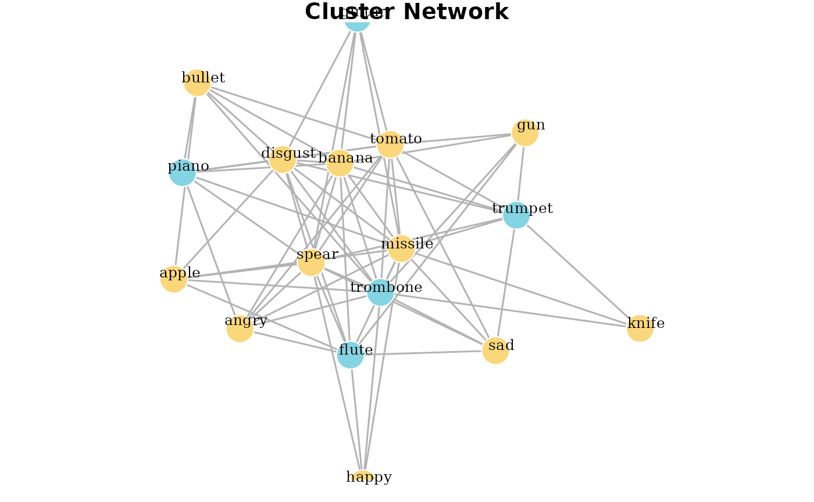

# SemanticDistance_Data_Viz

## Data Visualization Options

`SemanticDistance` contains two primary visualization options. Most
users will be able to plot monologue distances as continuously changing
time series using simple approaches like `ggline`, specializing bells
and whistles to their own unique needs. The visualization funtions we
have included are used for gleaning structure(s) from lists of words. At
present, these options include hierarchical cluster analysis (producing
a triangle dendrogram) and network analysis (producing a simple
undirected graph network). Each of these approaches uses simple machine
learning algorithms (kmeans) to determine optimal cluster sizes.

## STEP 1: CLEAN AND FORMAT YOUR MONOLOGUE OR LIST

``` r
#Start from 
MyCleanList <- clean_monologue_or_list(Unordered_List, wordcol='mytext')
knitr::kable(head(MyCleanList, 10), format = "pipe")
```

| id_row_orig | text_initialsplit | word_clean | id_row_postsplit |
|:------------|:------------------|:-----------|-----------------:|
| 1           | trumpet           | trumpet    |                1 |
| 1           | trombone          | trombone   |                2 |
| 1           | flute             | flute      |                3 |
| 1           | piano             | piano      |                4 |
| 1           | guitar            | guitar     |                5 |
| 1           | gun               | gun        |                6 |
| 1           | knife             | knife      |                7 |
| 1           | missile           | missile    |                8 |
| 1           | bullet            | bullet     |                9 |
| 1           | spear             | spear      |               10 |

## STEP 2: CREATE DENDROGRAM or NETWORK

From your cleaned and formatted list, visualize relations between words

### Option 1: Hierarchical Cluster Dendrogram

Words on any vector of words but only makes sense for unordered word
lists! Produces a dendogram from a vector of words. First pulls words,
then creates a square matrix with cosine distances for all possible word
pairs: d\[i,j\]. Then converts semantic distance matrix to Euclidean
distance. Then plots a hierchcial clustering solution moving words
closer together in proximity based on their distance.  

Arguments:  
`dat` dataframe processed using
[`clean_monologue_or_list()`](https://reilly-conceptscognitionlab.github.io/SemanticDistance/reference/clean_monologue_or_list.md)  
`output` quoted argument `dendrogram` or `network` default is
`dendrogram`  
`dist_type` quoted argument, which distance norms would you like?
default is `embedding` alt is ‘SD15’

``` r
mydendro <- wordlist_to_network(MyCleanList, output='dendrogram', dist_type='embedding')
```


``` r
print(mydendro)
#> 'dendrogram' with 2 branches and 17 members total, at height 5.168642
```

### Option 2: iGraph network

Takes hclust properties from dendrogram steps and creates a simple
igraph object.  
`dat` dataframe cleaned using `clean_monologue_or_list`  
`output` quoted argument `dendrogram` or `network` default is
`dendrogram`  
`dist_type` default is ‘embedding’, alt is ‘SD15’

``` r
mynetwork <- wordlist_to_network(MyCleanList, output='network', dist_type='embedding')
```



``` r
print(mynetwork)
#> IGRAPH ce25555 UNW- 17 68 -- 
#> + attr: name (v/c), cluster (v/n), color (v/c), size (v/n), label
#> | (v/c), label.color (v/c), label.cex (v/n), weight (e/n), color (e/c),
#> | width (e/n)
#> + edges from ce25555 (vertex names):
#>  [1] trombone--missile trombone--gun     trombone--bullet  trombone--knife  
#>  [5] trombone--spear   trombone--apple   trombone--banana  trombone--tomato 
#>  [9] trombone--disgust trombone--angry   trombone--sad     trombone--happy  
#> [13] piano   --missile piano   --bullet  piano   --spear   piano   --banana 
#> [17] piano   --tomato  piano   --disgust piano   --angry   guitar  --missile
#> [21] guitar  --spear   guitar  --banana  guitar  --tomato  guitar  --disgust
#> + ... omitted several edges
```
