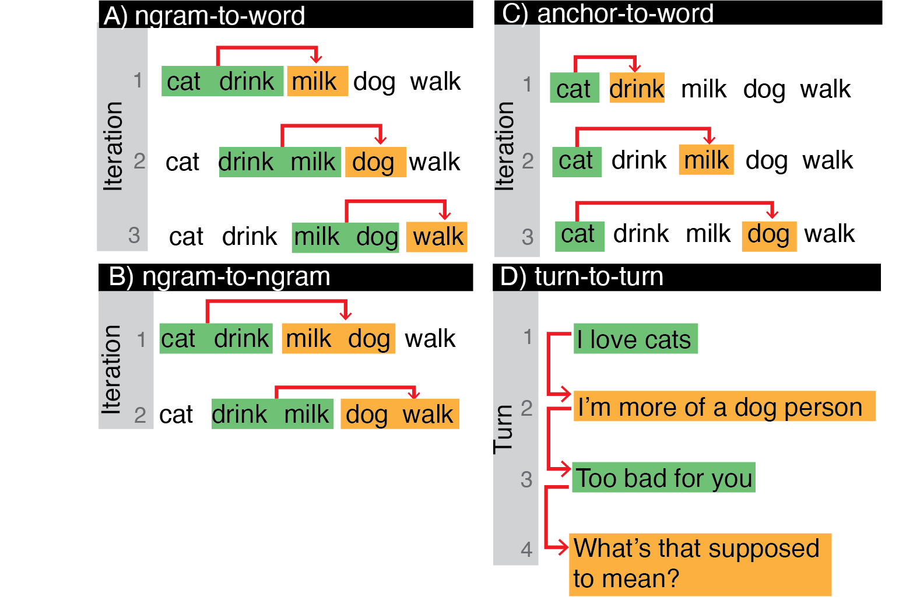
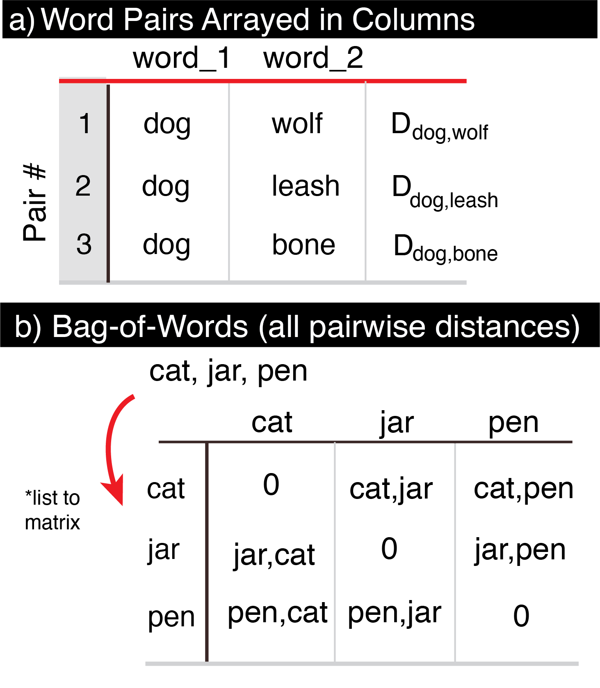

```{r, include=FALSE}
options(tinytex.verbose = TRUE)
```


# Summary
 `SemanticDistance` computes pairwise distance between units of language (e.g., word-to-word, ngram-to-word, turn-to-turn) in both structured language samples and unstructured word lists. `SemanticDistance` has cleaning and formatting options including stopword removal and lemmatization. The package computes two complementary cosine distance indices for each pairwise contrast of interest. `SemanticDistance` can also be used to examine clustering properties within unstructured word lists, generating dendrograms and simple igraph network plots.  
 
# Software Design
 `SemanticDistance` was is an open-source R package designed to accommodate a wide range of user expertise (e.g., neuroscience, linguistics, computer science). The software does not leverage artificial intelligence or use any proprietary dependencies. The package instead indexes an internal lookup database containing publicly available lexical norms.

# Statment of need
`SemanticDistance` is unique in its capacity to compute semantic distance metrics within running language samples (e.g., word-to-word, bigram-to-word) and to produce semantic network visualizations. The package also provides complementary (but different) semantic distance metrics (experiential vs. embedding) computed over the same stimuli. This package will support novel insights into the flow of meaning within naturalistic language samples.

# Research Impact Statement
 `SemanticDistance` has supported one peer-reviewed publication to date in the journal, `Cortex` [@Mechtenberg:2026] along with one refereed conference presentation at the annual conference of the Society for the Neurobiology of Language. Importantly, the application enables a variety of analyses that have been formerly difficult or impossible, including comparing semantic distance measures with other measure of prediction in language, including those generated by large language models.
 
# Description
`SemanticDistance` bundles text cleaning and formatting options (e.g., stopword removal, lemmatization) with two  two complementary semantic distance metrics (i.e., experiential vs. embeddings) that characterize/quantify similarity between pairs of language constituents (e.g., words, ngrams, turns). Semantic distance values are derived on demand by indexing two large lookup databases that contain semantic vectors for many English words.\newline   

One of the most innovative functions of `SemanticDistance` is its capacity to generate rolling measures of semantic distance within stories or narratives with chunk sizes (e.g., word-to-word, turn-to-turn). Chunk size is an optional argument for many of the software's functions. For example, if a user specified a chunk or n-gram size of 5 words, the software would automatically compute a rollinhg measure of semantic distance betweem each new word in a language sample relative to the five words that preceded it. Figure 1 illustrates options for computing rolling semantic distance in text samples word order is essential (e.g., monologues, dialogues, narratives). Figure 2 represents options for computing distances in list formats (e.g., word pairs in columns, unordered lists).  \newline  

{width=70%}

\vspace*{-0.5cm}
\newline

{width=30%}
\vspace*{-0.5cm}
\newline

# AI Usage
`SemanticDistance` uses an internal database composed of many words with a fixed set of embeddings. The software does not use AI or rely on proprietary package dependencies. We did use GPT-4.0 (OpenAI) to troubleshoot R coding errors and assist with generating complex regular expressions (regex) used for cleaning text data. 

# References

