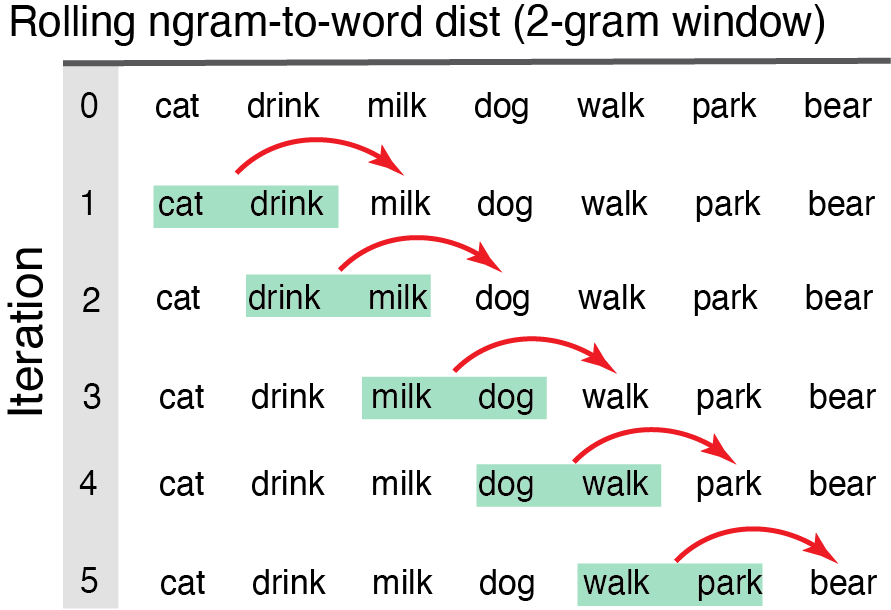
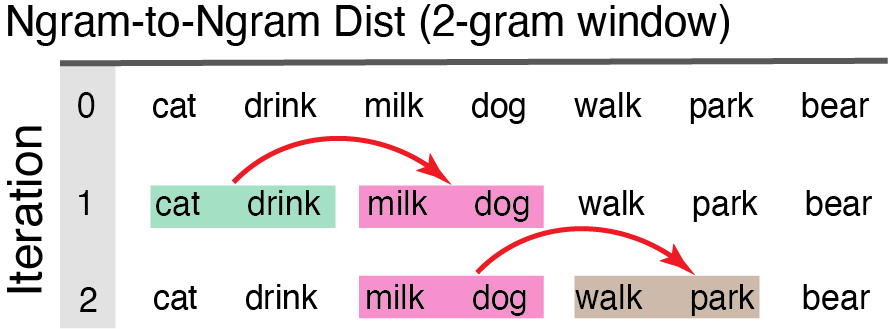
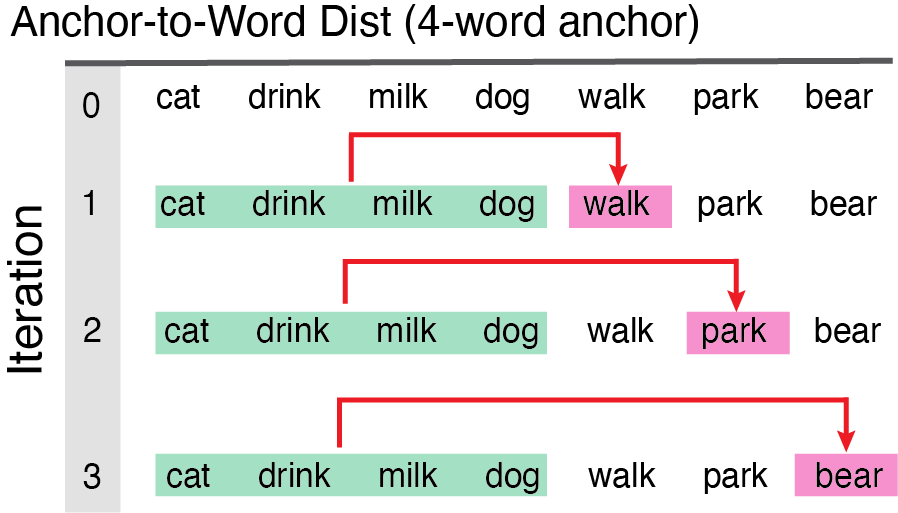
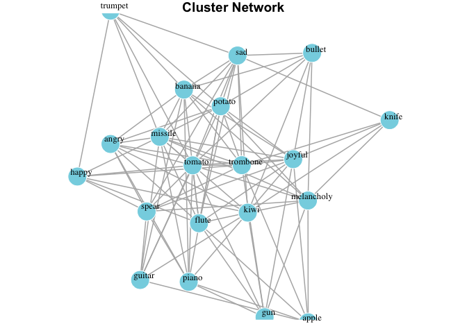
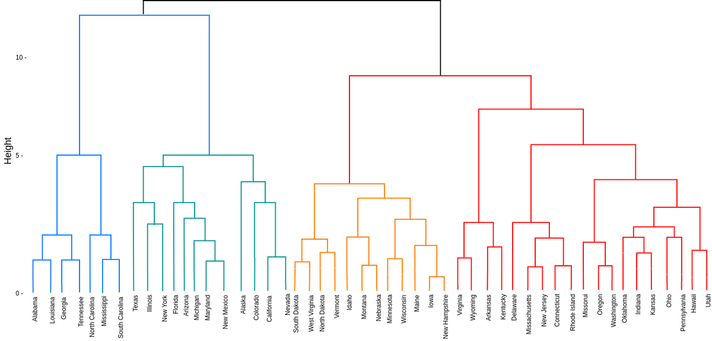

# Statment of Need
Although numerous R and Python packages process word embeddings, none to our knowledge is capable of computing distances in situ -- within naturalistic language samples (e.g., distance from one word to the next in a dialogue or story). A deeper understanding of how the brain processes semantic relationships at different levels of granularity (e.g., word-to-word, sentence-to-word) may be critical for understanding language breakdown and developing informed interventions. `SemanticDistance` will likely contribute to these efforts by bundling text cleaning, distance computations, and network modeling into a single user-friendly resource. 

# Description
There are many ways to assess similarity between two concepts (represented as words) [@malt_words_2020]. Consider, for example, the case of a wildlife biologist interested in quantifying the distance between *wolf* and *dog* in terms of perceived threat to humans. How might she quantify this distance? One common approach might involve quering a representative sample of people and asking them to rate their own subjective threat for dogs and wolves using a Lickert scale. The difference score between dogs and wolves represents a semantic distance constrained by threat. Although the true dimensionality of human semantic memory is latent, most approaches to modeling word meaning (including embeddings) decompose words across high dimensional semantic spaces  [@Landauer_LSA_1997,  @reilly_what_2025, @Pennington2014].  

`SemanticDistance` computes distance metrics between each pair of elements (e.g., words, ngrams, turns) specified by the user. These distance values are derived from two large lookup databases containing fixed semantic vectors for >70k English words. `CosDist_Glo` reflects cosine distance between vectors derived from training a GLOVE word embedding model (300 hyperparameters per word) [@Pennington2014]. `CodDist_SD15` refects cosine distance between two chunks (words, groups of words) characterized across 15 meaningful perceptual and affective dimensions (e.g., color, sound, valence) [@Reilly2023]. Before using `SemanticDistance`, users should do some background reading on what the distance metrics mean and how the functions should be optimized to produce the desired. `SemanticDistance` processes distance relationships between lexical constituents (words, ngrams, sentences, turns) within the following text formats:  
- **monologues** stories, narratives, and structured text where order matters
- **dialogues** two-person conversation transcripts
- **word pairs in columns** dog and leash arrayed in two columns
- **unordered lists** bags-of-words where order is irrelevant.

One advantage of the `SemanticDistance` package is that bundles text cleaning and formatting options (e.g., stopword removal, lemmatization) with distance and network visualization options. Another helpful feature of `SemanticDistance` is that it generates rolling measures of semantic distance within structured text. In structured texts like monologues (stories, narratives) and dialogues (two-person conversation transcripts), word order matters.  In contrast, unordered word lists can be thought of as bags-of-words. `SemanticDistance` can run distance metrics on both of these formats with options for chunk size guided by the user. These various options are illustrated in the section to follow.  
 

# Examples of Distance Functions and Possible Applications
 
## Ngram-to-Word Distance (monologues, stories, continuous structured language) 
Computes rolling measure of semantic distance ngram-to-word across an ordered language sample. This metric may be used to iteratively examine larger integrative chunks from each word to its prior local or global context. We recently used this measure to examine brain sensitivity to distance jumps during real-time narrative comprehension using fMRI [@mechtenberg_measuring_2025].
 

{width=70%}
 

## Ngram-to-Ngram Distance (monologues, stories, continuous structured language) 
Computes semantic distance ngram-to-ngram across an ordered language sample. This metric may be used to examine semantic cohesion between chunks of language in linear narrative discourse.  
 
 
{width=80%}
 
 

## Anchored Distance (monologues, stories, continuous structured language) 
Computes semantic distance for each new word in a sample relative to the first block of n-words.Anchored distance can provide an empirical measure of semantic drift over the course of a sample (e.g., started with sports, jumped to baking).  
 

{width=70%}
 

## Turn-by-Turn Distance (2-person Dyads, Conversation Tramscripts)
Semantic distance between all the words in a turn vs. all the words in the next speaker's turn in a dialogue. This measure could be used to assess lexical-semantic comprehension in naturalistic conversations.
 

## Word Pair Distance (user arrayed word pairs in columns)
Generates pairwise distance metrics between two columns in a dataframe; useful for stimulus norming or posthoc analyses when no continuous metrics are needed 
 

# Finding structure in the chaos of unstructured word lists
`SemanticDistance` also includes several visualization options designed to elucidate structure within unstructured lists. The `wordlist_to_network` function takes a word list as an argument and derives cluster dendrograms or network plots. For example, here's how it uses a simple machine learning algoirthm to compute distances and cluster an unordered list of words

{width=100%}
{width=90%}

# References

